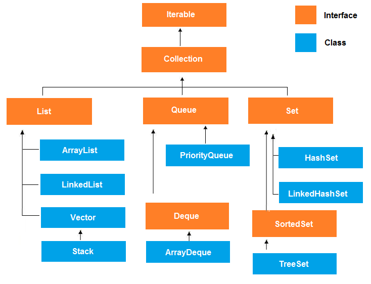
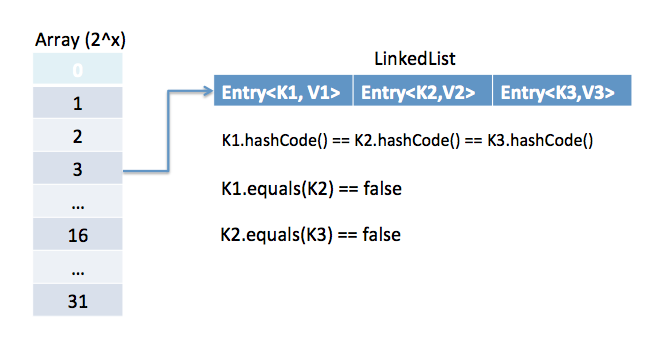

= Collections
:toc: macro
:numbered:

toc::[]

== Java Collections

=== What is the *Collections API*?  

The Collections API is a set of classes and interfaces that support operations on collections of objects. 

=== What are the *basic interfaces* of Java Collections Framework?

`Collection` is the root of the collection hierarchy. A collection represents a group of objects known as its elements. The Java platform doesn’t provide any direct implementations of this interface.

`Set` is a collection that cannot contain duplicate elements. This interface models the mathematical set abstraction and is used to represent sets, such as the deck of cards.

`List` is an ordered collection and can contain duplicate elements. You can access any element from it’s index. List is more like array with dynamic length.

`Map` is an object that maps keys to values. A map cannot contain duplicate keys: Each key can map to at most one value.

=== What is *Java Collections Framework*? List out some benefits of Collections framework?

Collections are used in every programming language and initial java release contained few classes for collections: **Vector**, **Stack**, **Hashtable**, **Array**. But looking at the larger scope and usage, Java 1.2 came up with Collections Framework that group all the collections interfaces, implementations and algorithms.  

Java Collections have come through a long way with usage of Generics and Concurrent Collection classes for thread-safe operations. It also includes blocking interfaces and their implementations in java concurrent package.  

Some of the benefits of collections framework are;

*   Reduced development effort by using core collection classes rather than implementing our own collection classes.
*   Code quality is enhanced with the use of well tested collections framework classes.
*   Reduced effort for code maintenance by using collection classes shipped with JDK.
*   Reusability and Interoperability

=== What is the benefit of *Generics* in Collections Framework?

Java 1.5 came with Generics and all collection interfaces and implementations use it heavily. Generics allow us to provide the type of `Object` that a collection can contain, so if you try to add any element of other type it throws compile time error.  

This avoids `ClassCastException` at Runtime because you will get the error at compilation. Also Generics make code clean since we don’t need to use casting and `instanceof` operator.

=== Why *`Vector`* class is used?  

The `Vector` class provides the capability to implement a growable array of objects. 

 very useful if you don't know the size of the array in advance, or you just need one that can change sizes over the lifetime of a program.  

=== What are the advantages of *ArrayList* over *arrays*?  

- ArrayList can grow dynamically 
- provides more powerful insertion and search mechanisms than arrays.  

=== Why *deletion in LinkedList* is fast than ArrayList?  

Deletion in linked list is fast because it involves only updating the next pointer in the node before the deleted node and updating the previous pointer in the node after the deleted node.  

=== What is *Comparable Interface*?

It is used to sort collections and arrays of objects using the `collections.sort()` and `java.utils`. The objects of the class implementing the `Comparable` interface can be ordered.  

=== What is Comparable and Comparator interface?

Comparable and Comparator interfaces are used to sort collection or array of objects.

Java provides `Comparable` interface which should be implemented by any custom class if we want to use `Arrays` or `Collections` sorting methods. Comparable interface has `compareTo(T obj)` method which is used by sorting methods. We should override this method in such a way that it returns a negative integer, zero, or a positive integer if “this” object is less than, equal to, or greater than the object passed as argument.

 Comparable interface is used to provide the natural sorting of objects and we can use it to provide sorting based on single logic.

But, in most real life scenarios, we want sorting based on different parameters. For example, as a CEO, I would like to sort the employees based on Salary, an HR would like to sort them based on the age. This is the situation where we need to use ``Comparator`` interface because ``Comparable.compareTo(Object o)``method implementation can sort based on one field only and we can’t chose the field on which we want to sort the Object.

`Comparator` interface `compare(Object o1, Object o2)` method need to be implemented that takes two Object argument, it should be implemented in such a way that it returns negative int if first argument is less than the second one and returns zero if they are equal and positive int if first argument is greater than second one.

 Comparator interface is used to provide different algorithms for sorting and we can chose the comparator we want to use to sort the given collection of objects.

=== **What is Comparable and Comparator interface ? List their differences.**

Java provides the `Comparable` interface, which contains only one method, called `compareTo`. This method compares two objects, in order to impose an order between them. Specifically, it returns a negative integer, zero, or a positive integer to indicate that the input object is less than, equal or greater than the existing object. 

Java provides the `Comparator` interface, which contains two methods, called `compare` and `equals`. The first method compares its two input arguments and imposes an order between them. It returns a negative integer, zero, or a positive integer to indicate that the first argument is less than, equal to, or greater than the second. The second method requires an object as a parameter and aims to decide whether the input object is equal to the comparator. The method returns true, only if the specified object is also a comparator and it imposes the same ordering as the comparator.

=== Why Collection doesn’t extend Cloneable and Serializable interfaces ?

Collection interface specifies group of Objects known as elements. How the elements are maintained is left up to the concrete implementations of Collection. For example, some Collection implementations like List allow duplicate elements whereas other implementations like Set don’t.  

A lot of the Collection implementations have a public clone method. However, it does’t really make sense to include it in all implementations of Collection. This is because Collection is an abstract representation. What matters is the implementation.  

The semantics and the implications of either cloning or serializing come into play when dealing with the actual implementation; so concrete implementation should decide how it should be cloned or serialized, or even if it can be cloned or serialized.  

So mandating cloning and serialization in all implementations is actually less flexible and more restrictive. The specific implementation should make the decision as to whether it can be cloned or serialized.

=== How can we sort a list of Objects?

If we need to sort an array of Objects, we can use ``Arrays.sort()``. If we need to sort a list of objects, we can use ``Collections.sort()``. Both these classes have overloaded sort() methods for natural sorting (using Comparable) or sorting based on criteria (using Comparator).  

Collections internally uses Arrays sorting method, so both of them have same performance except that Collections take sometime to convert list to array.

We need to implement Comparable interface to support sorting of custom objects in a collection. Comparable interface has compareTo(T obj) method which is used by sorting methods and by providing this method implementation, we can provide default way to sort custom objects collection.

However, if you want to sort based on different criteria, such as sorting an Employees collection based on salary or age, then we can create Comparator instances and pass it as sorting methodology. For more details read http://www.journaldev.com/780/java-comparable-and-comparator-example-to-sort-objects[Java Comparable and Comparator].

=== **What is an Iterator ?**

Iterator interface provides methods to iterate over any Collection. We can get iterator instance from a Collection using __iterator()__ method. Iterator takes the place of Enumeration in the Java Collections Framework. Iterators allow the caller to remove elements from the underlying collection during the iteration. Java Collection iterator provides a generic way for traversal through the elements of a collection and implements **http://www.journaldev.com/1716/iterator-design-pattern-in-java-example-tutorial[Iterator Design Pattern]**.

=== Why there is not method like Iterator.add() to add elements to the collection?

The semantics are unclear, given that the contract for Iterator makes no guarantees about the order of iteration. Note, however, that ListIterator does provide an add operation, as it does guarantee the order of the iteration.

=== Why Iterator don’t have a method to get next element directly without moving the cursor?

It can be implemented on top of current Iterator interface but since it’s use will be rare, it doesn’t make sense to include it in the interface that everyone has to implement.

=== What differences exist between Iterator and ListIterator ?

*   We can use Iterator to traverse Set and List collections whereas ListIterator can be used with Lists only.
*   Iterator can traverse in forward direction only whereas ListIterator can be used to traverse in both the directions.
*   ListIterator inherits from Iterator interface and comes with extra functionalities like adding an element, replacing an element, getting index position for previous and next elements.

=== Why there are no concrete implementations of Iterator interface?

`Iterator` interface declare methods for iterating a collection but it’s implementation is responsibility of the Collection implementation classes. Every collection class that returns an iterator for traversing has it’s own Iterator implementation nested class.  

This allows collection classes to chose whether iterator is fail-fast or fail-safe. For example ArrayList iterator is fail-fast whereas `CopyOnWriteArrayList` iterator is fail-safe.

=== What are different ways to iterate over a list?

We can iterate over a list in two different ways – using iterator and using for-each loop.

[source,java]
----
List<String> strList = new ArrayList<>();
//using for-each loop
for (String obj : strList) {
    System.out.println(obj);
}

//using iterator
Iterator<String> it = strList.iterator();
while (it.hasNext()) {
    String obj = it.next();
    System.out.println(obj);
}
----

Using iterator is more thread-safe because it makes sure that if underlying list elements are modified, it will throw ``ConcurrentModificationException``.

=== What do you understand by iterator fail-fast property?

Iterator fail-fast property checks for any modification in the structure of the underlying collection everytime we try to get the next element. If there are any modifications found, it throws``ConcurrentModificationException``. All the implementations of Iterator in Collection classes are fail-fast by design except the concurrent collection classes like ConcurrentHashMap and CopyOnWriteArrayList.

=== What is difference between fail-fast and fail-safe?

Iterator fail-safe property work with the clone of underlying collection, hence it’s not affected by any modification in the collection. By design, all the collection classes in ``java.util`` package are fail-fast whereas collection classes in ``java.util.concurrent`` are fail-safe.  

Fail-fast iterators throw `ConcurrentModificationException` whereas fail-safe iterator never throws this exception.  

Check this post for http://www.journaldev.com/1289/java-arraylist-vs-copyonwritearraylist-and-exploring-iterator[CopyOnWriteArrayList Example].

=== What is the importance of hashCode() and equals() methods ?

HashMap uses Key object hashCode() and equals() method to determine the index to put the key-value pair. These methods are also used when we try to get value from HashMap. If these methods are not implemented correctly, two different Key’s might produce same hashCode() and equals() output and in that case rather than storing it at different location, HashMap will consider them same and overwrite them.

Similarly all the collection classes that doesn’t store duplicate data use hashCode() and equals() to find duplicates, so it’s very important to implement them correctly. The implementation of equals() and hashCode() should follow these rules.

*   If ``o1.equals(o2)``, then ``o1.hashCode() == o2.hashCode()``should always be ``true``.
*   If ``o1.hashCode() == o2.hashCode`` is true, it doesn’t mean that ``o1.equals(o2)`` will be ``true``.

=== **What is Java Priority Queue ?**

The ``http://docs.oracle.com/javase/7/docs/api/java/util/PriorityQueue.html[PriorityQueue]`` is an unbounded queue, based on a priority heap and its elements are ordered in their natural order. At the time of its creation, we can provide a Comparator that is responsible for ordering the elements of the ``http://docs.oracle.com/javase/7/docs/api/java/util/PriorityQueue.html[PriorityQueue]``. A ``http://docs.oracle.com/javase/7/docs/api/java/util/PriorityQueue.html[PriorityQueue]`` doesn’t allow http://examples.javacodegeeks.com/java-basics/exceptions/java-lang-nullpointerexception-how-to-handle-null-pointer-exception/[null values], those objects that doesn’t provide natural ordering, or those objects that don’t have any comparator associated with them. Finally, the Java ``http://docs.oracle.com/javase/7/docs/api/java/util/PriorityQueue.html[PriorityQueue]`` is not thread-safe and it requires O(log(n)) time for its enqueing and dequeing operations.

=== **What are some of the best practices relating to the Java Collection framework ?**

*   Choosing the right type of the collection to use, based on the application’s needs, is very crucial for its performance. For example if the size of the elements is fixed and know a priori, we shall use an ``http://docs.oracle.com/javase/7/docs/api/java/lang/reflect/Array.html[Array]``, instead of an ``http://docs.oracle.com/javase/7/docs/api/java/util/ArrayList.html[ArrayList]``.
*   Some collection classes allow us to specify their initial capacity. Thus, if we have an estimation on the number of elements that will be stored, we can use it to avoid rehashing or resizing.
*   Always use Generics for type-safety, readability, and robustness. Also, by using Generics you avoid the``http://docs.oracle.com/javase/7/docs/api/java/lang/ClassCastException.html[ClassCastException]`` during runtime.
*   Use immutable classes provided by the Java Development Kit (JDK) as a key in a Map, in order to avoid the implementation of the ``http://docs.oracle.com/javase/7/docs/api/java/lang/Object.html#hashCode%28%29[hashCode]`` and equals methods for our custom class.
*   Program in terms of interface not implementation.
*   Return zero-length collections or arrays as opposed to returning a null in case the underlying collection is actually empty.

=== **What’s the difference between Enumeration and Iterator interfaces ?**
``http://docs.oracle.com/javase/7/docs/api/java/util/Enumeration.html[Enumeration]`` is twice as fast as compared to an Iterator and uses very less memory. However, the ``http://docs.oracle.com/javase/7/docs/api/java/util/Iterator.html[Iterator]`` is much safer compared to ``http://docs.oracle.com/javase/7/docs/api/java/util/Enumeration.html[Enumeration]``, because other threads are not able to modify the collection object that is currently traversed by the iterator. Also,``http://docs.oracle.com/javase/7/docs/api/java/util/Iterator.html[Iterators]``allow the caller to remove elements from the underlying collection, something which is not possible with``http://docs.oracle.com/javase/7/docs/api/java/util/Enumeration.html[Enumerations]``.

=== What is difference between Enumeration and Iterator interface?

Enumeration is twice as fast as Iterator and uses very less memory. Enumeration is very basic and fits to basic needs. But Iterator is much safer as compared to Enumeration because it always denies other threads to modify the collection object which is being iterated by it.  

Iterator takes the place of Enumeration in the Java Collections Framework. Iterators allow the caller to remove elements from the underlying collection that is not possible with Enumeration. Iterator method names have been improved to make it’s functionality clear.

=== What are Collection related features in Java 8?

Java 8 has brought major changes in the Collection API. Some of the changes are:

1.  http://www.journaldev.com/2774/java-8-stream-api-example-tutorial[Java Stream API] for collection classes for supporting sequential as well as parallel processing
2.  http://www.journaldev.com/2389/java-8-features-for-developers-lambdas-functional-interface-stream-and-time-api#iterable-forEach[Iterable interface is extended with forEach()] default method that we can use to iterate over a collection. It is very helpful when used with http://www.journaldev.com/2763/java-8-lambda-expressions-and-functional-interfaces-example-tutorial[lambda expressions] because it’s argument Consumer is a http://www.journaldev.com/2763/java-8-lambda-expressions-and-functional-interfaces-example-tutorial[function interface].
3.  Miscellaneous Collection API improvements such as ``forEachRemaining(Consumer action)`` method in``Iterator`` interface, Map ``replaceAll()``, ``compute()``, ``merge()`` methods.

=== How to avoid ConcurrentModificationException while iterating a collection?

We can use concurrent collection classes to avoid ``ConcurrentModificationException`` while iterating over a collection, for example CopyOnWriteArrayList instead of ArrayList.  

Check this post for http://www.journaldev.com/122/hashmap-vs-concurrenthashmap-%E2%80%93-example-and-exploring-iterator[ConcurrentHashMap Example].

=== What is UnsupportedOperationException?

``UnsupportedOperationException`` is the exception used to indicate that the operation is not supported. It’s used extensively in http://www.journaldev.com/546/difference-between-jdk-jre-and-jvm-in-java[JDK] classes, in collections framework ``java.util.Collections.UnmodifiableCollection``throws this exception for all ``add`` and ``remove`` operations.

=== What are different Collection views provided by Map interface?

Map interface provides three collection views:

1.  **Set keySet()**: Returns a Set view of the keys contained in this map. The set is backed by the map, so changes to the map are reflected in the set, and vice-versa. If the map is modified while an iteration over the set is in progress (except through the iterator’s own remove operation), the results of the iteration are undefined. The set supports element removal, which removes the corresponding mapping from the map, via the Iterator.remove, Set.remove, removeAll, retainAll, and clear operations. It does not support the add or addAll operations.
2.  **Collection values()**: Returns a Collection view of the values contained in this map. The collection is backed by the map, so changes to the map are reflected in the collection, and vice-versa. If the map is modified while an iteration over the collection is in progress (except through the iterator’s own remove operation), the results of the iteration are undefined. The collection supports element removal, which removes the corresponding mapping from the map, via the Iterator.remove, Collection.remove, removeAll, retainAll and clear operations. It does not support the add or addAll operations.
3.  **Set<Map.Entry<K, V>> entrySet()**: Returns a Set view of the mappings contained in this map. The set is backed by the map, so changes to the map are reflected in the set, and vice-versa. If the map is modified while an iteration over the set is in progress (except through the iterator’s own remove operation, or through the setValue operation on a map entry returned by the iterator) the results of the iteration are undefined. The set supports element removal, which removes the corresponding mapping from the map, via the Iterator.remove, Set.remove, removeAll, retainAll and clear operations. It does not support the add or addAll operations.

=== Which collection classes are thread-safe?

Vector, Hashtable, Properties and Stack are synchronized classes, so they are thread-safe and can be used in multi-threaded environment. Java 1.5 Concurrent API included some collection classes that allows modification of collection while iteration because they work on the clone of the collection, so they are safe to use in multi-threaded environment.

=== Is there a simple way to create a synchronized instance of an arbitrary implementation of ``Collection``, ``List`` or ``Map``?

The utility class Collections provides the methods ``synchronizedCollection(Collection)``, ``synchronizedList(List)`` and``synchronizedMap(Map)`` that return a thread-safe collection/list/map that is backed by the given instance.

=== What is BlockingQueue?

``java.util.concurrent.BlockingQueue`` is a Queue that supports operations that wait for the queue to become non-empty when retrieving and removing an element, and wait for space to become available in the queue when adding an element.

BlockingQueue interface is part of java collections framework and it’s primarily used for implementing producer consumer problem. We don’t need to worry about waiting for the space to be available for producer or object to be available for consumer in BlockingQueue as it’s handled by implementation classes of BlockingQueue.

Java provides several BlockingQueue implementations such as ArrayBlockingQueue, LinkedBlockingQueue, PriorityBlockingQueue, SynchronousQueue etc.  

Check this post for use of BlockingQueue for http://www.journaldev.com/1034/java-blockingqueue-example-implementing-producer-consumer-problem[producer-consumer problem].

=== What is Queue and Stack, list their differences?

Both Queue and Stack are used to store data before processing them. ``java.util.Queue`` is an interface whose implementation classes are present in java concurrent package. Queue allows retrieval of element in First-In-First-Out (FIFO) order but it’s not always the case. There is also Deque interface that allows elements to be retrieved from both end of the queue.  

Stack is similar to queue except that it allows elements to be retrieved in Last-In-First-Out (LIFO) order.  

Stack is a class that extends Vector whereas Queue is an interface.

=== What is Collections Class?

``java.util.Collections`` is a utility class consists exclusively of static methods that operate on or return collections. It contains polymorphic algorithms that operate on collections, “wrappers”, which return a new collection backed by a specified collection, and a few other odds and ends.

This class contains methods for collection framework algorithms, such as binary search, sorting, shuffling, reverse etc.

=== While passing a Collection as argument to a function, how can we make sure the function will not be able to modify it?

We can create a read-only collection using ``Collections.unmodifiableCollection(Collection c)`` method before passing it as argument, this will make sure that any operation to change the collection will throw ``UnsupportedOperationException``.

=== What are common algorithms implemented in Collections Framework?

Java Collections Framework provides algorithm implementations that are commonly used such as sorting and searching. Collections class contain these method implementations. Most of these algorithms work on List but some of them are applicable for all kinds of collections.  

Some of them are sorting, searching, shuffling, min-max values. 

=== Why can’t we write code as ``List<Number> numbers = new ArrayList();``?

Generics doesn’t support sub-typing because it will cause issues in achieving type safety. That’s why List<T> is not considered as a subtype of List<S> where S is the super-type of T. To understanding why it’s not allowed, let’s see what could have happened if it has been supported.

[source,java]
----
List<Long> listLong = new ArrayList<Long>();
listLong.add(Long.valueOf(10));
List<Number> listNumbers = listLong; // compiler error
listNumbers.add(Double.valueOf(1.23));
----

As you can see from above code that IF generics would have been supporting sub-typing, we could have easily add a Double to the list of Long that would have caused ``ClassCastException`` at runtime while traversing the list of Long.

=== Why can’t we create generic array? or write code as ``List[] array = new ArrayList[10];``

We are not allowed to create generic arrays because array carry type information of it’s elements at runtime. This information is used at runtime to throw ``ArrayStoreException`` if elements type doesn’t match to the defined type. Since generics type information gets erased at runtime by Type Erasure, the array store check would have been passed where it should have failed. Let’s understand this with a simple example code.

[source,java]
----
List[] intList = new List[5]; // compile error
Object[] objArray = intList;
List<Double> doubleList = new ArrayList<Double>();
doubleList.add(Double.valueOf(1.23));
objArray[0] = doubleList; // this should fail but it would pass because at runtime intList and doubleList both are just List
----

Arrays are covariant by nature i.e S[] is a subtype of T[] whenever S is a subtype of T but generics doesn’t support covariance or sub-typing as we saw in last question. So if we would have been allowed to create generic arrays, because of type erasure we would not get array store exception even though both types are not related.

=== What do you know about the big-O notation and can you give some examples with respect to different data structures ?

The http://www.javacodegeeks.com/2011/04/simple-big-o-notation-post.html[Big-O notation] simply describes how well an algorithm scales or performs in the worst case scenario as the number of elements in a data structure increases. The Big-O notation can also be used to describe other behavior such as memory consumption. Since the collection classes are actually data structures, we usually use the Big-O notation to chose the best implementation to use, based on time, memory and performance. Big-O notation can give a good indication about performance for large amounts of data.

Example 1: ArrayList ``get(index i)`` is a constant-time operation and doesn’t depend on the number of elements in the list. So it’s performance in Big-O notation is O(1).  

Example 2: A linear search on array or list performance is O(n) because we need to search through entire list of elements to find the element.

=== **What is the tradeoff between using an unordered array versus an ordered array ?**

The major advantage of an ordered array is that the search times have time complexity of O(log n), compared to that of an unordered array, which is O (n). The disadvantage of an ordered array is that the insertion operation has a time complexity of O(n), because the elements with higher values must be moved to make room for the new element. Instead, the insertion operation for an unordered array takes constant time of O(1).

''''''''''''''''''''''''''''''''''''''''''''''''''''''''''''''''''''''''''''''''''''''''''''''''''''''''''''

== List

=== How do you decide when to use ArrayList and LinkedList?

If you need to frequently add and remove elements from the middle of the list and only access the list elements sequentially, then LinkedList should be used. If you need to support random access, without inserting or removing elements from any place other than the end, then ArrayList should be used.  

=== **What is difference between ArrayList and LinkedList ?**

Both the ``http://docs.oracle.com/javase/7/docs/api/java/util/ArrayList.html[ArrayList]`` and ``http://docs.oracle.com/javase/7/docs/api/java/util/LinkedList.html[LinkedList]`` classes implement the List interface, but they differ on the following features:

*   An ``http://docs.oracle.com/javase/7/docs/api/java/util/ArrayList.html[ArrayList]`` is an index based data structure backed by an ``http://docs.oracle.com/javase/7/docs/api/java/lang/reflect/Array.html[Array]``. It provides random access to its elements with a performance equal to O(1). On the other hand, a ``http://docs.oracle.com/javase/7/docs/api/java/util/LinkedList.html[LinkedList]`` stores its data as list of elements and every element is linked to its previous and next element. In this case, the search operation for an element has execution time equal to O(n).
*   The Insertion, addition and removal operations of an element are faster in a ``http://docs.oracle.com/javase/7/docs/api/java/util/LinkedList.html[LinkedList]`` compared to an ``http://docs.oracle.com/javase/7/docs/api/java/util/ArrayList.html[ArrayList]``, because there is no need of resizing an array or updating the index when an element is added in some arbitrary position inside the collection.
*   A ``http://docs.oracle.com/javase/7/docs/api/java/util/LinkedList.html[LinkedList]`` consumes more memory than an ``http://docs.oracle.com/javase/7/docs/api/java/util/ArrayList.html[ArrayList]``, because every node in a ``http://docs.oracle.com/javase/7/docs/api/java/util/LinkedList.html[LinkedList]`` stores two references, one for its previous element and one for its next element.

=== What is difference between Array and ArrayList ? When will you use Array over ArrayList ?

The ``http://docs.oracle.com/javase/7/docs/api/java/lang/reflect/Array.html[Array]``and ``http://docs.oracle.com/javase/7/docs/api/java/util/ArrayList.html[ArrayList]`` classes differ on the following features:

*   ``http://docs.oracle.com/javase/7/docs/api/java/util/Arrays.html[Arrays]`` can contain primitive or objects, while an ``http://docs.oracle.com/javase/7/docs/api/java/util/ArrayList.html[ArrayList]`` can contain only objects.
*   ``http://docs.oracle.com/javase/7/docs/api/java/util/Arrays.html[Arrays]`` have fixed size, while an ``http://docs.oracle.com/javase/7/docs/api/java/util/ArrayList.html[ArrayList]`` is dynamic.
*   An ``http://docs.oracle.com/javase/7/docs/api/java/util/ArrayList.html[ArrayList]``provides more methods and features, such as ``http://docs.oracle.com/javase/7/docs/api/java/util/ArrayList.html#addAll(java.util.Collection)[addAll]``, ``http://docs.oracle.com/javase/7/docs/api/java/util/ArrayList.html#removeAll(java.util.Collection)[removeAll]``, ``http://docs.oracle.com/javase/7/docs/api/java/util/ArrayList.html#iterator()[iterator]``, etc.
*   For a list of primitive data types, the collections use autoboxing to reduce the coding effort. However, this approach makes them slower when working on fixed size primitive data types.

=== What is difference between Array and ArrayList? When will you use Array over ArrayList?

Arrays can contain primitive or Objects whereas ArrayList can contain only Objects.  

Arrays are fixed size whereas ArrayList size is dynamic.  

Arrays doesn’t provide a lot of features like ArrayList, such as addAll, removeAll, iterator etc.

Although ArrayList is the obvious choice when we work on list, there are few times when array are good to use.

*   If the size of list is fixed and mostly used to store and traverse them.
*   For list of primitive data types, although Collections use autoboxing to reduce the coding effort but still it makes them slow when working on fixed size primitive data types.
*   If you are working on fixed multi-dimensional situation, using [][] is far more easier than List<List<>>

=== What are similarities and difference between ArrayList and Vector?

ArrayList and Vector are similar classes in many ways.

1.  Both are index based and backed up by an array internally.
2.  Both maintains the order of insertion and we can get the elements in the order of insertion.
3.  The iterator implementations of ArrayList and Vector both are fail-fast by design.
4.  ArrayList and Vector both allows null values and random access to element using index number.
These are the differences between ArrayList and Vector.

1.  Vector is synchronized whereas ArrayList is not synchronized. However if you are looking for modification of list while iterating, you should use CopyOnWriteArrayList.
2.  ArrayList is faster than Vector because it doesn’t have any overhead because of synchronization.
3.  ArrayList is more versatile because we can get synchronized list or read-only list from it easily using Collections utility class.

''''''''''''''''''''''''''''''''''''''''''''''''''''''''''''''''''''''''''''''''''''''''''''''''''''''''''''

== Map

=== Why Map interface doesn’t extend Collection interface?

Although Map interface and it’s implementations are part of Collections Framework, Map are not collections and collections are not Map. Hence it doesn’t make sense for Map to extend Collection or vice versa.  

If Map extends Collection interface, then where are the elements? Map contains key-value pairs and it provides methods to retrieve list of Keys or values as Collection but it doesn’t fit into the “group of elements” paradigm.

=== **How HashMap works in Java ?**
A http://www.javacodegeeks.com/2014/03/how-hashmap-works-in-java.html[HashMap in Java stores key-value pairs]. The ``http://docs.oracle.com/javase/7/docs/api/java/util/HashMap.html[HashMap]`` requires a hash function and uses ``http://docs.oracle.com/javase/7/docs/api/java/lang/Object.html#hashCode%28%29[hashCode]`` and equals methods, in order to put and retrieve elements to and from the collection respectively. When the put method is invoked, the ``http://docs.oracle.com/javase/7/docs/api/java/util/HashMap.html[HashMap]`` calculates the hash value of the key and stores the pair in the appropriate index inside the collection. If the key exists, its value is updated with the new value. Some important characteristics of a``http://docs.oracle.com/javase/7/docs/api/java/util/HashMap.html[HashMap]`` are its capacity, its load factor and the threshold resizing.

---

HashMap stores key-value pair in ``Map.Entry`` static nested class implementation. HashMap works on hashing algorithm and uses hashCode() and equals() method in ``put`` and ``get`` methods.

When we call ``put`` method by passing key-value pair, HashMap uses Key hashCode() with hashing to find out the index to store the key-value pair. The Entry is stored in the LinkedList, so if there are already existing entry, it uses equals() method to check if the passed key already exists, if yes it overwrites the value else it creates a new entry and store this key-value Entry.

When we call ``get`` method by passing Key, again it uses the hashCode() to find the index in the array and then use equals() method to find the correct Entry and return it’s value. Below image will explain these detail clearly.

The other important things to know about HashMap are capacity, load factor, threshold resizing. HashMap initial default capacity is **16** and load factor is 0.75. Threshold is capacity multiplied by load factor and whenever we try to add an entry, if map size is greater than threshold, HashMap rehashes the contents of map into a new array with a larger capacity. The capacity is always power of 2, so if you know that you need to store a large number of key-value pairs, for example in caching data from database, it’s good idea to initialize the HashMap with correct capacity and load factor.

=== **What differences exist between HashMap and Hashtable ?**
Both the ``http://docs.oracle.com/javase/7/docs/api/java/util/HashMap.html[HashMap]`` and ``http://docs.oracle.com/javase/7/docs/api/java/util/Hashtable.html[Hashtable]`` classes implement the Map interface and thus, have very similar characteristics. However, they differ in the following features:

*   A ``http://docs.oracle.com/javase/7/docs/api/java/util/HashMap.html[HashMap]`` allows the existence of null keys and values, while a ``http://docs.oracle.com/javase/7/docs/api/java/util/Hashtable.html[Hashtable]`` doesn’t allow neither null keys, nor null values.
*   A ``http://docs.oracle.com/javase/7/docs/api/java/util/Hashtable.html[Hashtable]`` is synchronized, while a ``http://docs.oracle.com/javase/7/docs/api/java/util/HashMap.html[HashMap]`` is not. Thus, ``http://docs.oracle.com/javase/7/docs/api/java/util/HashMap.html[HashMap]`` is preferred in single-threaded environments, while a ``http://docs.oracle.com/javase/7/docs/api/java/util/Hashtable.html[Hashtable]`` is suitable for multi-threaded environments.
*   A ``http://docs.oracle.com/javase/7/docs/api/java/util/HashMap.html[HashMap]`` provides its set of keys and a Java application can iterate over them. Thus, a ``http://docs.oracle.com/javase/7/docs/api/java/util/HashMap.html[HashMap]`` is fail-fast. On the other hand, a ``http://docs.oracle.com/javase/7/docs/api/java/util/Hashtable.html[Hashtable]`` provides an ``http://docs.oracle.com/javase/7/docs/api/java/util/Enumeration.html[Enumeration]`` of its keys.
*   The ``http://docs.oracle.com/javase/7/docs/api/java/util/Hashtable.html[Hashtable]`` class is considered to be a legacy class.

=== How to decide between HashMap and TreeMap?

For inserting, deleting, and locating elements in a Map, the HashMap offers the best alternative. If, however, you need to traverse the keys in a sorted order, then TreeMap is your better alternative. Depending upon the size of your collection, it may be faster to add elements to a HashMap, then convert the map to a TreeMap for sorted key traversal.

=== Can we use any class as Map key?

We can use any class as Map Key, however following points should be considered before using them.

*   If the class overrides equals() method, it should also override hashCode() method.
*   The class should follow the rules associated with equals() and hashCode() for all instances. Please refer earlier question for these rules.
*   If a class field is not used in equals(), you should not use it in hashCode() method.
*   Best practice for user defined key class is to make it immutable, so that hashCode() value can be cached for fast performance. Also immutable classes make sure that hashCode() and equals() will not change in future that will solve any issue with mutability.

For example, let’s say I have a class `MyKey` that I am using for HashMap key.

[source,java]
----
//MyKey name argument passed is used for equals() and hashCode()
MyKey key = new MyKey("Pankaj"); //assume hashCode=1234
myHashMap.put(key, "Value");

// Below code will change the key hashCode() and equals()
// but it's location is not changed.
key.setName("Amit"); //assume new hashCode=7890

//below will return null, because HashMap will try to look for key
//in the same index as it was stored but since key is mutated,
//there will be no match and it will return null.
myHashMap.get(new MyKey("Pankaj"));
----

This is the reason why String and Integer are mostly used as HashMap keys.

''''''''''''''''''''''''''''''''''''''''''''''''''''''''''''''''''''''''''''''''''''''''''''''''''''''''''''

== Set

=== Explain Set Interface?  

It is a collection of element which cannot contain duplicate elements. The Set interface contains only methods inherited from Collection and adds the restriction that duplicate elements are prohibited.

=== Explain TreeSet?  

It is a Set implemented when we want elements in a sorted order.

=== **What is the difference between HashSet and TreeSet ?**

The ``http://docs.oracle.com/javase/7/docs/api/java/util/HashSet.html[HashSet]`` is Implemented using a hash table and thus, its elements are not ordered. The add, remove, and contains methods of a ``http://docs.oracle.com/javase/7/docs/api/java/util/HashSet.html[HashSet]`` have constant time complexity O(1). On the other hand, a ``http://docs.oracle.com/javase/7/docs/api/java/util/TreeSet.html[TreeSet]`` is implemented using a tree structure. The elements in a ``http://docs.oracle.com/javase/7/docs/api/java/util/TreeSet.html[TreeSet]`` are sorted, and thus, the add, remove, and contains methods have time complexity of O(logn).

=== What is EnumSet?

``java.util.EnumSet`` is Set implementation to use with enum types. All of the elements in an enum set must come from a single enum type that is specified, explicitly or implicitly, when the set is created. EnumSet is not synchronized and null elements are not allowed. It also provides some useful methods like copyOf(Collection c), of(E first, E… rest) and complementOf(EnumSet s).

Check this post for http://www.journaldev.com/716/java-enum-examples-with-benefits-and-class-usage[java enum tutorial].

