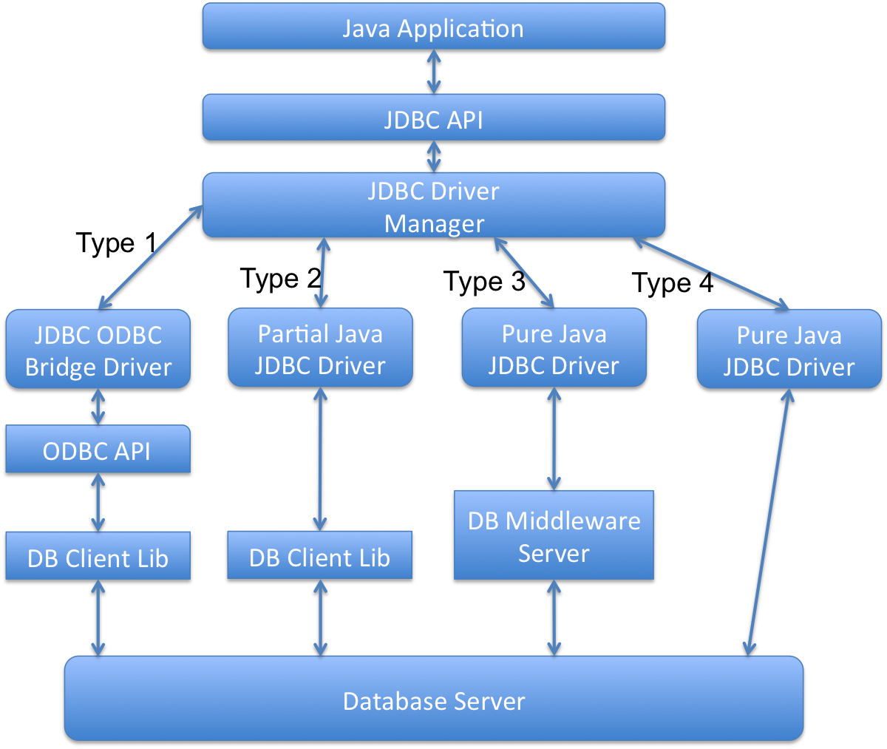

= JDBC
:toc: macro
:numbered:

toc::[]


== JDBC


=== What is JDBC API and when do we use it?

**Java DataBase Connectivity** API allows us to work with relational databases. JDBC API interfaces and classes are part of ``java.sql`` and ``javax.sql`` package. We can use JDBC API to get the database connection, run SQL queries and stored procedures in the database server and process the results.

JDBC API is written in a way to allow loose coupling between our Java program and actual JDBC drivers that makes our life easier in switching from one database to another database servers easily.


=== What is JDBC ?

JDBC is an abstraction layer that allows users to choose between databases. http://www.javacodegeeks.com/2014/03/java-8-friday-java-8-will-revolutionize-database-access.html[JDBC enables developers to write database applications in Java], without having to concern themselves with the underlying details of a particular database.


=== What are different types of JDBC Drivers?

There are four types of JDBC drivers. Any java program that works with database has two parts, first part is the JDBC API and second part is the driver that does the actual work.



1.  **JDBC-ODBC Bridge plus ODBC Driver (Type 1)**: It uses ODBC driver to connect to database. We should have ODBC drivers installed to connect to database, that’s why this driver is almost obsolete.
2.  **Native API partly Java technology-enabled driver (Type 2)**: This driver converts JDBC class to the client API for the database servers. We should have database client API installed. Because of extra dependency on database client API drivers, this is also not preferred driver.
3.  **Pure Java Driver for Database Middleware (Type 3)**: This driver sends the JDBC calls to a middleware server that can connect to different type of databases. We should have a middleware server installed to work with this driver. This adds to extra network calls and slow performance and thats why not widely used JDBC driver.
4.  **Direct-to-Database Pure Java Driver (Type 4)**: This driver converts the JDBC calls to the network protocol understood by the database server. This solution is simple and suitable for database connectivity over the network. However for this solution, we should use database specific drivers, for example OJDBC jars by Oracle for Oracle DB and MySQL Connector/J for MySQL databases.


=== Explain the role of Driver in JDBC. 

The JDBC Driver provides vendor-specific implementations of the abstract classes provided by the JDBC API. Each driver must provide implementations for the following classes of the java.sql package:``http://docs.oracle.com/javase/7/docs/api/java/sql/Connection.html[Connection]``, ``http://docs.oracle.com/javase/7/docs/api/java/sql/Statement.html[Statement]``, ``http://docs.oracle.com/javase/7/docs/api/java/sql/PreparedStatement.html[PreparedStatement]``, ``http://docs.oracle.com/javase/7/docs/api/java/sql/CallableStatement.html[CallableStatement]``, ``http://docs.oracle.com/javase/7/docs/api/java/sql/ResultSet.html[ResultSet]`` and ``http://docs.oracle.com/javase/7/docs/api/java/sql/Driver.html[Driver]``.


=== What is JDBC Statement?

JDBC API ``Statement`` is used to execute SQL queries in the database. We can create the Statement object by calling Connection __getStatement()__ method. We can use Statement to execute static SQL queries by passing query through different execute methods such as execute(), executeQuery(), executeUpdate() etc.

Since the query is generated in the java program, if the user input is not properly validated it can lead to SQL injection issue, more details can be found at http://www.journaldev.com/2489/jdbc-statement-vs-preparedstatement-sql-injection-example[SQL Injection Example].

By default, only one ResultSet object per Statement object can be open at the same time. Therefore, if we want to work with multiple ResultSet objects, then each must have been generated by different Statement objects. All execute() methods in the Statement interface implicitly close a statment’s current ResultSet object if an open one exists.


=== What is the difference between execute, executeQuery, executeUpdate?

Statement __execute(String query)__ is used to execute any SQL query and it returns TRUE if the result is an ResultSet such as running Select queries. The output is FALSE when there is no ResultSet object such as running Insert or Update queries. We can use __getResultSet()__ to get the ResultSet and __getUpdateCount()__method to retrieve the update count.

Statement __executeQuery(String query)__ is used to execute Select queries and returns the ResultSet. ResultSet returned is never null even if there are no records matching the query. When executing select queries we should use executeQuery method so that if someone tries to execute insert/update statement it will throw java.sql.SQLException with message “executeQuery method can not be used for update”.

Statement executeUpdate(String query) is used to execute Insert/Update/Delete (DML) statements or DDL statements that returns nothing. The output is int and equals to the row count for SQL Data Manipulation Language (DML) statements. For DDL statements, the output is 0.

You should use execute() method only when you are not sure about the type of statement else use executeQuery or executeUpdate method.


=== What is JDBC PreparedStatement?

JDBC ``PreparedStatement`` object represents a precompiled SQL statement. We can use it’s setter method to set the variables for the query.

Since PreparedStatement is precompiled, it can then be used to efficiently execute this statement multiple times. PreparedStatement is better choice that Statement because it automatically escapes the special characters and avoid SQL injection attacks.


=== What are the benefits of PreparedStatement over Statement?

Some of the benefits of PreparedStatement over Statement are:

*   PreparedStatement helps us in preventing SQL injection attacks because it automatically escapes the special characters.
*   PreparedStatement allows us to execute dynamic queries with parameter inputs.
*   PreparedStatement is faster than Statement. It becomes more visible when we reuse the PreparedStatement or use it’s batch processing methods for executing multiple queries.
*   PreparedStatement helps us in writing object Oriented code with setter methods whereas with Statement we have to use String Concatenation to create the query. If there are multiple parameters to set, writing Query using String concatenation looks very ugly and error prone.


=== What is the limitation of PreparedStatement and how to overcome it?

One of the limitation of PreparedStatement is that we can’t use it directly with IN clause statements. Some of the alternative approaches to use PreparedStatement with IN clause are;

1.  **Execute Single Queries** – very slow performance and not recommended
2.  **Using Stored Procedure** – Database specific and hence not suitable for multiple database applications.
3.  **Creating PreparedStatement Query dynamically** – Good approach but looses the benefit of cached PreparedStatement.
4.  **Using NULL in PreparedStatement Query** – A good approach when you know the maximum number of variables inputs, can be extended to allow unlimited parameters by executing in parts.
A more detailed analysis can be found at http://www.journaldev.com/2521/jdbc-preparedstatement-in-clause-alternative-approaches[JDBC PreparedStatement IN clause alternatives].


=== How to set NULL values in JDBC PreparedStatement?

We can use PreparedStatement setNull() method to bind the null variable to a parameter. The setNull method takes index and SQL Types as argument, for example  
``ps.setNull(10, java.sql.Types.INTEGER);``.


=== What is JDBC ResultSet?

JDBC ``ResultSet`` is like a table of data representing a database result set, which is usually generated by executing a statement that queries the database.

ResultSet object maintains a cursor pointing to its current row of data. Initially the cursor is positioned before the first row. The next() method moves the cursor to the next row. If there are no more rows, next() method returns false and it can be used in a while loop to iterate through the result set.

A default ResultSet object is not updatable and has a cursor that moves forward only. Thus, you can iterate through it only once and only from the first row to the last row. It is possible to produce ResultSet objects that are scrollable and/or updatable using below syntax.


```java
Statement stmt = con.createStatement(ResultSet.TYPE_SCROLL_INSENSITIVE,
                                   ResultSet.CONCUR_UPDATABLE);
```

A ResultSet object is automatically closed when the Statement object that generated it is closed, re-executed, or used to retrieve the next result from a sequence of multiple results.

We can use ResultSet getter method with column name or index number starting from 1 to retrieve the column data.


=== What are different types of ResultSet?

There are different types of ResultSet objects that we can get based on the user input while creating the Statement. If you will look into the Connection methods, you will see that createStatement() and prepareStatement() method are overloaded to provide ResultSet type and concurrency as input argument.

There are three types of ResultSet object.

1.  **ResultSet.TYPE_FORWARD_ONLY**: This is the default type and cursor can only move forward in the result set.
2.  **ResultSet.TYPE_SCROLL_INSENSITIVE**: The cursor can move forward and backward, and the result set is not sensitive to changes made by others to the database after the result set was created.
3.  **ResultSet.TYPE_SCROLL_SENSITIVE**: The cursor can move forward and backward, and the result set is sensitive to changes made by others to the database after the result set was created.
Based on the concurrency there are two types of ResultSet object.

1.  **ResultSet.CONCUR_READ_ONLY**: The result set is read only, this is the default concurrency type.
2.  **ResultSet.CONCUR_UPDATABLE**: We can use ResultSet update method to update the rows data.


=== What is JDBC RowSet? What are different types of RowSet?

JDBC ``RowSet`` holds tabular data in more flexible ways that ResultSet. All RowSet objects are derived from ResultSet, so they have all the capabilities of ResultSet with some additional features. RowSet interface is defined in ``javax.sql`` package.

Some additional features provided by RowSet are:

*   Functions as Java Beans with properties and their getter-setter methods. RowSet uses JavaBeans event model and they can send notifications to any registered component for events such as cursor movement, update/insert/delete of a row and change to RowSet contents.
*   RowSet objects are scrollable and updatable by default, so if DBMS doesn’t support scrollable or updatable ResultSet, we can use RowSet to get these features.
RowSet are broadly divided into two types:

1.  **Connected RowSet Objects** – These objects are connected to database and are most similar to ResultSet object. JDBC API provides only one connected RowSet object ``javax.sql.rowset.JdbcRowSet``and it’s standard implementation class is ``com.sun.rowset.JdbcRowSetImpl``
2.  **Disconnected RowSet Objects** – These RowSet objects are not required to connected to a database, so they are more lightweight and serializable. They are suitable for sending data over a network. There are four types of disconnected RowSet implementations.

        *   CachedRowSet – They can get the connection and execute a query and read the ResultSet data to populate the RowSet data. We can manipulate and update data while it is disconnected and reconnect to database and write the changes.
    *   WebRowSet derived from CachedRowSet – They can read and write XML document.
    *   JoinRowSet derived from WebRowSet – They can form SQL JOIN without having to connect to a data source.
    *   FilteredRowSet derived from WebRowSet – We can apply filtering criteria so that only selected data is visible.

=== What is the different between ResultSet and RowSet?

RowSet objects are derived from ResultSet, so they have all the features of ResultSet with some additional features. One of the huge benefit of RowSet is that they can be disconnected and that makes it lightweight and easy to transfer over a network.

Whether to use ResultSet or RowSet depends on your requirements but if you are planning to use ResultSet for longer duration, then a disconnected RowSet is better choice to free database resources.


=== What is JDBC Batch Processing and what are it’s benefits?

Sometimes we need to run bulk queries of similar kind for a database, for example loading data from CSV files to relational database tables. As we know that we have option to use Statement or PreparedStatement to execute queries. Apart from that JDBC API provides Batch Processing feature through which we can execute bulk of queries in one go for a database.

JDBC API supports batch processing through Statement and PreparedStatement ``addBatch()`` and``executeBatch()`` methods.

Batch Processing is faster than executing one statement at a time because the number of database calls are less, read more at http://www.journaldev.com/2494/jdbc-batch-processing-example-tutorial-with-insert-statements[JDBC Batch Processing Example].


=== What is the advantage of PreparedStatement over Statement ? 

PreparedStatements are precompiled and thus, http://examples.javacodegeeks.com/core-java/sql/batch-statement-execution-example/[their performance is much better]. Also, PreparedStatement objects can be reused with different input values to their queries.

=== What is the use of CallableStatement ? Name the method, which is used to prepare a CallableStatement.

A ``http://docs.oracle.com/javase/7/docs/api/java/sql/CallableStatement.html[CallableStatement]`` is used to execute stored procedures. Stored procedures are stored and offered by a database. Stored procedures may take input values from the user and may return a result. The usage of stored procedures is highly encouraged, because it offers security and modularity.The method that prepares a ``http://docs.oracle.com/javase/7/docs/api/java/sql/CallableStatement.html[CallableStatement]`` is the following:

[source,xml]
----
CallableStament.prepareCall();
----


=== What is JDBC Transaction Management and why do we need it?

By default when we create a database connection, it runs in auto-commit mode. It means that whenever we execute a query and it’s completed, the commit is fired automatically. So every SQL query we fire is a transaction and if we are running some DML or DDL queries, the changes are getting saved into database after every SQL statement finishes.

Sometimes we want a group of SQL queries to be part of a transaction so that we can commit them when all the queries runs fine and if we get any exception, we have a choice of rollback all the queries executed as part of the transaction.

JDBC API provide method ``setAutoCommit(boolean flag)`` through which we can disable the auto commit feature of the connection. We should disable auto commit only when it’s required because the transaction will not be committed unless we call the commit() method on connection. Database servers uses table locks to achieve transaction management and it’s resource intensive process. So we should commit the transaction as soon as we are done with it. Read more with example program athttp://www.journaldev.com/2483/jdbc-transaction-management-and-savepoint-example-tutorial[JDBC Transaction Management Example].


=== How to rollback a JDBC transaction?

We can use Connection object ``rollback()`` method to rollback the transaction. It will rollback all the changes made by the transaction and release any database locks currently held by this Connection object.


=== What is JDBC Savepoint? How to use it?

Sometimes a transaction can be group of multiple statements and we would like to rollback to a particular point in the transaction. JDBC Savepoint helps us in creating checkpoints in a transaction and we can rollback to that particular checkpoint.

Any savepoint created for a transaction is automatically released and become invalid when the transaction is committed, or when the entire transaction is rolled back. Rolling a transaction back to a savepoint automatically releases and makes invalid any other savepoints that were created after the savepoint in question. Read more at http://www.journaldev.com/2483/jdbc-transaction-management-and-savepoint-example-tutorial[JDBC Savepoint Example].


=== What is JDBC DataSource and what are it’s benefits?

JDBC DataSource is the interface defined in ``javax.sql`` package and it is more powerful that DriverManager for database connections. We can use DataSource to create the database connection and Driver implementation classes does the actual work for getting connection. Apart from getting Database connection, DataSource provides some additional features such as:

*   Caching of PreparedStatement for faster processing
*   Connection timeout settings
*   Logging features
*   ResultSet maximum size threshold
*   Connection Pooling in servlet container using JNDI support
Read more about DataSource at http://www.journaldev.com/2509/jdbc-datasource-example-oracle-mysql-and-apache-dbcp-tutorial[JDBC DataSource Example].


=== What does Connection pooling mean ? 

The interaction with a database can be costly, regarding the opening and closing of database connections. Especially, when the number of database clients increases, this cost is very high and a large number of resources is consumed.A pool of database connections is obtained at start up by the application server and is maintained in a pool. A request for a connection is served by a http://examples.javacodegeeks.com/enterprise-java/hibernate/hibernate-connection-pool-configuration-with-c3p0-example/[connection residing in the pool]. In the end of the connection, the request is returned to the pool and can be used to satisfy future requests.


=== How does JDBC API helps us in achieving loose coupling between Java Program and JDBC Drivers API?

JDBC API uses http://www.journaldev.com/1789/java-reflection-tutorial-for-classes-methods-fields-constructors-annotations-and-much-more[Java Reflection API] to achieve loose coupling between java programs and JDBC Drivers. If you look at a simple JDBC example, you will notice that all the programming is done in terms of JDBC API and Driver comes in picture only when it’s loaded through reflection using ``Class.forName()`` method.

I think this is one of the best example of using Reflection in core java classes to make sure that our application doesn’t work directly with Drivers API and that makes it very easy to move from one database to another. Please read more at http://www.journaldev.com/2471/jdbc-example-tutorial-drivers-connection-statement-resultset[JDBC Example].


=== What is JDBC Connection? Explain steps to get Database connection in a simple java program.

JDBC Connection is like a Session created with the database server. You can also think Connection is like a http://www.journaldev.com/741/java-socket-server-client-read-write-example[Socket connection] from the database server.

Creating a JDBC Connection is very easy and requires two steps:

1.  Register and Load the Driver: Using ``Class.forName()``, Driver class is registered to the DriverManager and loaded in the memory.
2.  Use DriverManager to get the Connection object: We get connection object from``DriverManager.getConnection()`` by passing Database URL String, username and password as argument.

[source,java]
----
Connection con = null;
try{
    // load the Driver Class
    Class.forName("com.mysql.jdbc.Driver");
 
    // create the connection now
    con = DriverManager.getConnection("jdbc:mysql://localhost:3306/UserDB",
                    "pankaj",
                    "pankaj123");
    }catch (SQLException e) {
            System.out.println("Check database is UP and configs are correct");
            e.printStackTrace();
    }catch (ClassNotFoundException e) {
            System.out.println("Please include JDBC MySQL jar in classpath");
            e.printStackTrace();
    }
----

=== What is JDBC Connection isolation levels?

When we use JDBC Transactions for data integrity, DBMS uses locks to block access by others to the data being accessed by the transaction. DBMS uses locks to prevent Dirty Read, Non-Repeatable Reads and Phantom-Read issue.

JDBC transaction isolation level is used by DBMS to use the locking mechanism, we can get the isolation level information through Connection getTransactionIsolation() method and set it with setTransactionIsolation() method.

[width="100%",options="header,footer"]
|====
| Isolation Level | Transaction | Dirty Read | Non-Repeatable Read | Phantom Read
| TRANSACTION_NONE | Not Supported | Not Applicable | Not Applicable | Not Applicable
| TRANSACTION_READ_COMMITTED | Supported | Prevented | Allowed | Allowed
| TRANSACTION_READ_UNCOMMITTED | Supported | Allowed | Allowed | Allowed
| TRANSACTION_REPEATABLE_READ | Supported | Prevented | Prevented | Allowed
| TRANSACTION_SERIALIZABLE | Supported | Prevented | Prevented | Prevented
|====


=== What is “dirty read” in JDBC? Which isolation level prevents dirty read?

When we work with transactions, there is a chance that a row is updated and at the same time other query can read the updated value. This results in a dirty read because the updated value is not permanent yet, the transaction that has updated the row can rollback to previous value resulting in invalid data.

Dirty Read is prevented by isolation levels TRANSACTION_READ_COMMITTED, TRANSACTION_REPEATABLE_READ and TRANSACTION_SERIALIZABLE.


=== What is 2 phase commit?

When we work in distributed systems where multiple databases are involved, we are required to use 2 phase commit protocol. 2 phase commit protocol is an atomic commitment protocol for distributed systems. In the first phase, transaction manager sends commit-request to all the transaction resources. If all the transaction resources are OK, then transaction manager commits the transaction changes for all the resources. If any of the transaction resource responds as Abort, then the transaction manager can rollback all the transaction changes.


=== What is the use of JDBC DriverManager class?

JDBC ``DriverManager`` is the factory class through which we get the Database Connection object. When we load the JDBC Driver class, it registers itself to the DriverManager, you can look up the JDBC Driver classes source code to check this.

Then when we call ``DriverManager.getConnection()`` method by passing the database configuration details, DriverManager uses the registered drivers to get the Connection and return it to the caller program.


=== What are common JDBC Exceptions?

Some of the common JDBC Exceptions are:

1.  java.sql.SQLException – This is the base exception class for JDBC exceptions.
2.  java.sql.BatchUpdateException – This exception is thrown when Batch operation fails, but it depends on the JDBC driver whether they throw this exception or the base SQLException.
3.  java.sql.SQLWarning – For warning messages in SQL operations.
4.  java.sql.DataTruncation – when a data values is unexpectedly truncated for reasons other than its having exceeded MaxFieldSize.


=== How to get the Database server details in java program?

We can use ``DatabaseMetaData`` object to get the database server details. When the database connection is created successfully, we can get the meta data object by calling __getMetaData()__ method. There are so many methods in DatabaseMetaData that we can use to get the database product name, it’s version and configuration details.

[source,java]
----
DatabaseMetaData metaData = con.getMetaData();
String dbProduct = metaData.getDatabaseProductName();
----


=== What is the use of `getGeneratedKeys()` method in Statement?

Sometimes a table can have auto generated keys used to insert the unique column value for primary key. We can use Statement ``getGeneratedKeys()`` method to get the value of this auto generated key.


=== What is the use of setFetchSize() and setMaxRows() methods in Statement?

We can use ``setMaxRows(int i)`` method to limit the number of rows that the database returns from the query. You can achieve the same thing using SQL query itself. For example in MySQL we can use LIMIT clause to set the max rows that will be returned by the query.

Understanding **fetchSize** can be tricky, for that you should know how Statement and ResultSet works. When we execute a query in the database, the result is obtained and maintained in the database cache and ResultSet is returned. ResultSet is the cursor that has the reference to the result in the database.

Let’s say we have a query that returns 100 rows and we have set fetchSize to 10, so in every database trip JDBC driver will fetch only 10 rows and hence there will be 10 trips to fetch all the rows. Setting optimal fetchSize is helpful when you need a lot of processing time for each row and number of rows in the result is huge.

We can set fetchSize through Statement object but it can be overridden through ResultSet object setFetchSize() method.


=== How to use JDBC API to call Stored Procedures?

Stored Procedures are group of SQL queries that are compiled in the database and can be executed from JDBC API. JDBC ``CallableStatement`` can be used to execute stored procedures in the database. The syntax to initialize CallableStatement is;


```java
CallableStatement stmt = con.prepareCall("{call insertEmployee(?,?,?,?,?,?)}");
stmt.setInt(1, id);
stmt.setString(2, name);
stmt.setString(3, role);
stmt.setString(4, city);
stmt.setString(5, country);
 
//register the OUT parameter before calling the stored procedure
stmt.registerOutParameter(6, java.sql.Types.VARCHAR);
              
stmt.executeUpdate();
```

We need to register the OUT parameters before executing the CallableStatement. More details about this can be found at http://www.journaldev.com/2502/jdbc-callablestatement-stored-procedure-in-out-oracle-struct-cursor-example-tutorial[JDBC CallableStatement Example].


=== What is the purpose Class.forName method ? 

This method is used to method is used to load the driver that will establish a connection to the database.


=== What is CLOB and BLOB datatypes in JDBC?

Character Large OBjects (CLOBs) are character string made up of single-byte characters with an associated code page. This data type is appropriate for storing text-oriented information where the amount of information can grow beyond the limits of a regular VARCHAR data type (upper limit of 32K bytes).

Binary Large OBjects (BLOBs) are binary string made up of bytes with no associated code page. This data type can store binary data larger than VARBINARY (32K limit). This data type is good for storing image, voice, graphical, and other types of business or application-specific data.


=== What are JDBC Best Practices?

Some of the JDBC Best Practices are:

*   Database resources are heavy, so make sure you close it as soon as you are done with it. Connection, Statement, ResultSet and all other JDBC objects have close() method defined to close them.
*   Always close the result set, statement and connection explicitly in the code, because if you are working in connection pooling environment, the connection might be returned to the pool leaving open result sets and statement objects resulting in resource leak.
*   Close the resources in the finally block to make sure they are closed even in case of exception scenarios.
*   Use batch processing for bulk operations of similar kind.
*   Always use PreparedStatement over Statement to avoid SQL Injection and get pre-compilation and caching benefits of PreparedStatement.
*   If you are retrieving bulk data into result set, setting an optimal value for fetchSize helps in getting good performance.
*   The database server might not support all isolation levels, so check it before assuming.
*   More strict isolation levels result in slow performance, so make sure you have optimal isolation level set for your database connections.
*   If you are creating database connections in a web application, try to use JDBC DataSource resources using JNDI context for re-using the connections.
*   Try to use disconnected RowSet when you need to work with ResultSet for a long time.


