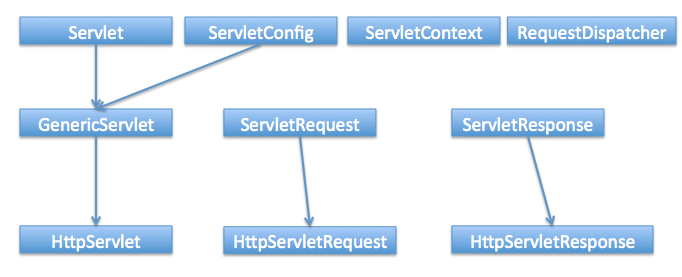

= Web, Servlets, JSP
:toc: macro
:numbered:

toc::[]

== Web

=== What is different between web server and application server?

A web server responsibility is to handler HTTP requests from client browsers and respond with HTML response. A web server understands HTTP language and runs on HTTP protocol.  

Apache Web Server is kind of a web server and then we have specific containers that can execute servlets and JSPs known as servlet container, for example Tomcat.  

Application Servers provide additional features such as Enterprise JavaBeans support, JMS Messaging support, Transaction Management etc. So we can say that Application server is a web server with additional functionalities to help developers with enterprise applications.

=== Which HTTP method is non-idempotent?

A HTTP method is said to be idempotent if it returns the same result every time. HTTP methods GET, PUT, DELETE, HEAD, and OPTIONS are idempotent method and we should implement our application to make sure these methods always return same result. HTTP method POST is non-idempotent method and we should use post method when implementing something that changes with every request.

For example, to access an HTML page or image, we should use GET because it will always return the same object but if we have to save customer information to database, we should use POST method. Idempotent methods are also known as safe methods and we don’t care about the repetitive request from the client for safe methods.

=== What is the difference between GET and POST method?

*   GET is a safe method (idempotent) where POST is non-idempotent method.
*   We can send limited data with GET method and it’s sent in the header request URL whereas we can send large amount of data with POST because it’s part of the body.
*   GET method is not secure because data is exposed in the URL and we can easily bookmark it and send similar request again, POST is secure because data is sent in request body and we can’t bookmark it.
*   GET is the default HTTP method whereas we need to specify method as POST to send request with POST method.
*   Hyperlinks in a page uses GET method.

=== What is MIME Type?

The “Content-Type” response header is known as MIME Type. Server sends MIME type to client to let them know the kind of data it’s sending. It helps client in rendering the data for user. Some of the mostly used mime types are text/html, text/xml, application/xml etc.

We can use ServletContext getMimeType() method to get the correct MIME type of the file and use it to set the response content type. It’s very useful in downloading file through servlet from server.

=== What is URL Encoding?

URL Encoding is the process of converting data into CGI form so that it can travel across the network without any issues. URL Encoding strip the white spaces and replace special characters with escape characters. We can use java.net.URLEncoder.encode(String str, String unicode) to encode a String. URL Decoding is the reverse process of encoding and we can use java.net.URLDecoder.decode(String str, String unicode) to decode the encoded string. For example “Pankaj’s Data” is encoded to “Pankaj%27s+Data”.

=== What is the difference between encodeRedirectUrl and encodeURL?

HttpServletResponse provide method to encode URL in HTML hyperlinks so that the special characters and white spaces are escaped and append session id to the URL. It behaves similar to URLEncoder encode method with additional process to append jsessionid parameter at the end of the URL.

However HttpServletResponse encodeRedirectUrl() method is used specially for encode the redirect URL in response.

So when we are providing URL rewriting support, for hyperlinks in HTML response, we should use encodeURL() method whereas for redirect URL we should use encodeRedirectUrl() method.

=== What is meant by a Web Application ? 

A Web application is a dynamic extension of a Web or application server. There are two types of web applications: presentation-oriented and service-oriented. A presentation-oriented Web application generates interactive web pages, which contain various types of markup language and dynamic content in response to requests. On the other hand, a service-oriented web application implements the endpoint of a web service. In general, a Web application can be seen as a collection of servlets installed under a specific subset of the server’s URL namespace.

=== What is a Server Side Include (SSI) ? 

Server Side Includes (SSI) is a simple interpreted server-side scripting language, used almost exclusively for the Web, and is embedded with a servlet tag. The most frequent use of SSI is to include the contents of one or more files into a Web page on a Web server. When a Web page is accessed by a browser, the Web server replaces the servlet tag in that Web page with the hyper text generated by the corresponding servlet.

=== What is the structure of the HTTP response ? 

The HTTP response consists of three parts:

*   **Status Code**: describes the status of the response. It can be used to check if the request has been successfully completed. In case the request failed, the status code can be used to find out the reason behind the failure. If your servlet does not return a status code, the success status code, HttpServletResponse.SC_OK, is returned by default.
*   **HTTP Headers**: they contain more information about the response. For example, the headers may specify the date/time after which the response is considered stale, or the form of encoding used to safely transfer the entity to the user. See http://examples.javacodegeeks.com/enterprise-java/servlet/get-all-request-headers-in-servlet/[how to retrieve headers in Servlet here].
*   **Body**: it contains the content of the response. The body may contain HTML code, an image, etc. The body consists of the data bytes transmitted in an HTTP transaction message immediately following the headers.

=== What is a cookie ? What is the difference between session and cookie ?

http://examples.javacodegeeks.com/core-java/net/urlconnection/get-cookies-from-http-connection/[A cookie] is a bit of information that the Web server sends to the browser. The browser stores the cookies for each Web server in a local file. In a future request, the browser, along with the request, sends all stored cookies for that specific Web server.The differences between session and a cookie are the following:

*   The session should work, regardless of the settings on the client browser. The client may have chosen to disable cookies. However, the sessions still work, as the client has no ability to disable them in the server side.
*   The session and cookies also differ in the amount of information the can store. The HTTP session is capable of storing any Java object, while a cookie can only store String objects.

=== What is HTTP Tunneling ? 

HTTP Tunneling is a technique by which, communications performed using various network protocols are encapsulated using the HTTP or HTTPS protocols. The HTTP protocol therefore acts as a wrapper for a channel that the network protocol being tunneled uses to communicate. The masking of other protocol requests as HTTP requests is HTTP Tunneling.

'''''''''''''''''''''''''''''''''''''''''''''''''''''''''''''''''''''''''''''''''''''

== Servlet

=== What is a servlet?

http://examples.javacodegeeks.com/enterprise-java/servlet/sample-java-servlet/[The servlet] is a Java programming language class used to process client requests and generate dynamic web content. Servlets are mostly used to process or store data submitted by an HTML form, provide dynamic content and manage state information that does not exist in the stateless HTTP protocol.

Java Servlet is server side technologies to extend the capability of web servers by providing support for dynamic response and data persistence.

The javax.servlet and javax.servlet.http packages provide interfaces and classes for writing our own servlets.  

All servlets must implement the javax.servlet.Servlet interface, which defines servlet lifecycle methods. When implementing a generic service, we can extend the GenericServlet class provided with the Java Servlet API. The HttpServlet class provides methods, such as doGet() and doPost(), for handling HTTP-specific services.

Most of the times, web applications are accessed using HTTP protocol and thats why we mostly extend HttpServlet class. Servlet API hierarchy is shown in below image.

=== Explain the architechure of a Servlet. 

The core abstraction that must be implemented by all servlets is the `javax.servlet.Servlet` interface. Each servlet must implement it either directly or indirectly, either by extending `javax.servlet.GenericServlet` or `javax.servlet.http.HTTPServlet`. Finally, each servlet is able to serve multiple requests in parallel using multithreading.

=== What is Servlet Chaining ? 

Servlet Chaining is the method where the output of one servlet is sent to a second servlet. The output of the second servlet can be sent to a third servlet, and so on. The last servlet in the chain is responsible for sending the response to the client.

=== What are important features of Servlet 3?

Servlet Specs 3.0 was a major release and some of the important features are:

1.  **Servlet Annotations**: Prior to Servlet 3, all the servlet mapping and it’s init parameters were used to defined in web.xml, this was not convenient and more error prone when number of servlets are huge in an application.
Servlet 3 introduced use of java annotations to define a servlet, filter and listener servlets and init parameters. Some of the important Servlet API annotations are WebServlet, WebInitParam, WebFilter and WebListener. Read more about them at http://www.journaldev.com/1877/java-servlet-tutorial-with-examples-for-beginners#servlet-3-annotations[Servlet 3 annotations].

2.  **Web Fragments**: Prior to servlet specs 3.0, all the web application configurations are required to be present in the web.xml that makes it cluttered with lot of elements and chances of error increases. So servlet 3 specs introduced web fragments where we can have multiple modules in a single web application, all these modules should have web-fragment.xml file in META-INF directory. We can include all the elements of web.xml inside the web-fragment.xml too. This helps us in dividing our web application into separate modules that are included as JAR file in the web application lib directory.
3.  **Adding Web Components dynamically**: We can use ServletContext object to add servlets, filters and listeners programmatically. This helps us in building dynamic system where we are loading a component only if we need it. These methods are addServlet(), addFilter() and addListener() defined in the servlet context object.
4.  **Asynchronous Processing**: Asynchronous support was added to delegate the request processing to another thread rather than keeping the servlet thread busy. It can increase the throughput performance of the application. This is an advance topic and I recommend to read http://www.journaldev.com/2008/async-servlet-feature-of-servlet-3[**Async Servlet**]tutorial.

=== What are common tasks performed by Servlet Container?

Servlet containers are also known as web container, for example Tomcat. Some of the important tasks of servlet container are:

*   **Communication Support**: Servlet Container provides easy way of communication between web client (Browsers) and the servlets and JSPs. Because of container, we don’t need to build a server socket to listen for any request from web client, parse the request and generate response. All these important and complex tasks are done by container and all we need to focus is on business logic for the applications.
*   **Lifecycle and Resource Management**: Servlet Container takes care of managing the life cycle of servlet. From the loading of servlets into memory, initializing servlets, invoking servlet methods and to destroy them. Container also provides utility like JNDI for resource pooling and management.
*   **Multithreading Support**: Container creates new thread for every request to the servlet and provide them request and response objects to process. So servlets are not initialized for each request and saves time and memory.
*   **JSP Support**: JSPs doesn’t look like normal java classes but every JSP in the application is compiled by container and converted to Servlet and then container manages them like other servlets.
*   **Miscellaneous Task**: Servlet container manages the resource pool, perform memory optimizations, execute garbage collector, provides security configurations, support for multiple applications, hot deployment and several other tasks behind the scene that makes a developer life easier.

=== What is ServletConfig object?

``javax.servlet.ServletConfig`` is used to pass configuration information to Servlet. Every servlet has it’s own **ServletConfig** object and servlet container is responsible for instantiating this object. We can provide servlet init parameters in web.xml file or through use of WebInitParam annotation. We can use getServletConfig() method to get the ServletConfig object of the servlet.

=== What is ServletContext object?

``javax.servlet.ServletContext`` interface provides access to web application parameters to the servlet. The ServletContext is unique object and available to all the servlets in the web application. When we want some init parameters to be available to multiple or all of the servlets in the web application, we can use ServletContext object and define parameters in web.xml using <context-param> element. We can get the ServletContext object via the __getServletContext()__ method of ServletConfig. Servlet containers may also provide context objects that are unique to a group of servlets and which is tied to a specific portion of the URL path namespace of the host.

ServletContext is enhanced in Servlet Specs 3 to introduce methods through which we can programmatically add Listeners and Filters and Servlet to the application. It also provides some utility methods such as __getMimeType()__, __getResourceAsStream()__ etc.

=== What is difference between ServletConfig and ServletContext?

Some of the differences between ServletConfig and ServletContext are:

*   ServletConfig is a unique object per servlet whereas ServletContext is a unique object for complete application.
*   ServletConfig is used to provide init parameters to the servlet whereas ServletContext is used to provide application level init parameters that all other servlets can use.
*   We can’t set attributes in ServletConfig object whereas we can set attributes in ServletContext that other servlets can use in their implementation.

=== What is Request Dispatcher?

RequestDispatcher interface is used to forward the request to another resource that can be HTML, JSP or another servlet in same application. We can also use this to include the content of another resource to the response. This interface is used for inter-servlet communication in the same context.

There are two methods defined in this interface:

1.  void forward(ServletRequest request, ServletResponse response) – forwards the request from a servlet to another resource (servlet, JSP file, or HTML file) on the server.
2.  void include(ServletRequest request, ServletResponse response) – includes the content of a resource (servlet, JSP page, HTML file) in the response.
We can get RequestDispatcher in a servlet using ServletContext getRequestDispatcher(String path) method. The path must begin with a / and is interpreted as relative to the current context root.

=== What is difference between PrintWriter and ServletOutputStream?

PrintWriter is a character-stream class whereas ServletOutputStream is a byte-stream class. We can use PrintWriter to write character based information such as character array and String to the response whereas we can use ServletOutputStream to write byte array data to the response.

We can use ServletResponse getWriter() to get the PrintWriter instance whereas we can use ServletResponse getOutputStream() method to get the ServletOutputStream object reference.

You can read more about IO in java at http://www.journaldev.com/942/java-io-tutorial[**Java IO Tutorial**].

=== Can we get PrintWriter and ServletOutputStream both in a servlet?

We can’t get instances of both PrintWriter and ServletOutputStream in a single servlet method, if we invoke both the methods; getWriter() and getOutputStream() on response; we will get``java.lang.IllegalStateException`` at runtime with message as other method has already been called for this response.

=== How can we create deadlock situation in servlet?

We can create deadlock in servlet by making a loop of method invocation, just call doPost() method from doGet() method and doGet() method to doPost() method to create deadlock situation in servlet.

Read more about deadlock in multithreading at http://www.journaldev.com/1058/java-deadlock-example-and-how-to-analyze-deadlock-situation[**Java Deadlock Example**].

=== What is the use of servlet wrapper classes?

Servlet HTTP API provides two wrapper classes – ``HttpServletRequestWrapper`` and``HttpServletResponseWrapper``. These wrapper classes are provided to help developers with custom implementation of servlet request and response types. We can extend these classes and override only specific methods we need to implement for custom request and response objects. These classes are not used in normal servlet programming.

=== What is SingleThreadModel interface?

SingleThreadModel interface was provided for thread safety and it guarantees that no two threads will execute concurrently in the servlet’s service method. However SingleThreadModel does not solve all thread safety issues. For example, session attributes and static variables can still be accessed by multiple requests on multiple threads at the same time, even when SingleThreadModel servlets are used. Also it takes out all the benefits of multithreading support of servlets, thats why this interface is Deprecated in Servlet 2.4.

=== Do we need to override service() method?

When servlet container receives client request, it invokes the service() method which in turn invokes the doGet(), doPost() methods based on the HTTP method of request. I don’t see any use case where we would like to override service() method. The whole purpose of service() method is to forward to request to corresponding HTTP method implementations. If we have to do some pre-processing of request, we can always use servlet filters and listeners.

=== Is it good idea to create servlet constructor?

We can define a constructor for servlet but I don’t think its of any use because we won’t be having access to the ServletConfig object until unless servlet is initialized by container. Ideally if we have to initialize any resource for servlet, we should override init() method where we can access servlet init parameters using ServletConfig object.

=== What is difference between GenericServlet and HttpServlet?

GenericServlet is protocol independent implementation of Servlet interface whereas HttpServlet is HTTP protocol specific implementation. Most of the times we use servlet for creating web application and that’s why we extend HttpServlet class. HttpServlet class extends GenericServlet and also provide some other methods specific to HTTP protocol.

GenericServlet is a generalized and protocol-independent servlet that implements the Servlet and ServletConfig interfaces. Those servlets extending the GenericServlet class shall override the service method. Finally, in order to develop an HTTP servlet for use on the Web that serves requests using the HTTP protocol, your servlet must extend the HttpServlet instead. Check http://examples.javacodegeeks.com/tag/servlet/[Servlet examples here].

=== What is the inter-servlet communication?

When we want to invoke another servlet from a servlet service methods, we use inter-servlet communication mechanisms. We can invoke another servlet using RequestDispatcher forward() and include() methods and provide additional attributes in request for other servlet use.

=== Are Servlets Thread Safe? How to achieve thread safety in servlets?

HttpServlet init() method and destroy() method are called only once in servlet life cycle, so we don’t need to worry about their synchronization. But service methods such as doGet() or doPost() are getting called in every client request and since servlet uses multithreading, we should provide thread safety in these methods.

If there are any local variables in service methods, we don’t need to worry about their thread safety because they are specific to each thread but if we have a shared resource then we can use synchronization to achieve thread safety in servlets when working with shared resources.

The thread safety mechanisms are similar to thread safety in standalone java application, read more about them at http://www.journaldev.com/1061/java-synchronization-and-thread-safety-tutorial-with-examples[**Thread Safety in Java**].

=== What is servlet attributes and their scope?

Servlet attributes are used for inter-servlet communication, we can set, get and remove attributes in web application. There are three scopes for servlet attributes – request scope, session scope and application scope.

ServletRequest, HttpSession and ServletContext interfaces provide methods to get/set/remove attributes from request, session and application scope respectively.

Servlet attributes are different from init parameters defined in web.xml for ServletConfig or ServletContext.

=== How do we call one servlet from another servlet?

We can use RequestDispatcher forward() method to forward the processing of a request to another servlet. If we want to include the another servlet output to the response, we can use RequestDispatcher include() method.

=== How can we invoke another servlet in a different application?

We can’t use RequestDispatcher to invoke servlet from another application because it’s specific for the application. If we have to forward the request to a resource in another application, we can use ServletResponse sendRedirect() method and provide complete URL of another servlet. This sends the response to client with response code as 302 to forward the request to another URL. If we have to send some data also, we can use cookies that will be part of the servlet response and sent in the request to another servlet.

=== What is difference between ServletResponse sendRedirect() and RequestDispatcher forward() method?

1.  RequestDispatcher forward() is used to forward the same request to another resource whereas ServletResponse sendRedirect() is a two step process. In sendRedirect(), web application returns the response to client with status code 302 (redirect) with URL to send the request. The request sent is a completely new request.
2.  forward() is handled internally by the container whereas sednRedirect() is handled by browser.
3.  We should use forward() when accessing resources in the same application because it’s faster than sendRedirect() method that required an extra network call.
4.  In forward() browser is unaware of the actual processing resource and the URL in address bar remains same whereas in sendRedirect() URL in address bar change to the forwarded resource.
5.  forward() can’t be used to invoke a servlet in another context, we can only use sendRedirect() in this case.

=== Why HttpServlet class is declared abstract?

HttpServlet class provide HTTP protocol implementation of servlet but it’s left abstract because there is no implementation logic in service methods such as doGet() and doPost() and we should override at least one of the service methods. That’s why there is no point in having an instance of HttpServlet and is declared abstract class.

Read more about http://www.journaldev.com/1582/abstract-class-in-java-with-example[**abstract class**].

=== What are the phases of servlet life cycle?

We know that Servlet Container manages the life cycle of Servlet, there are four phases of servlet life cycle.

1.  Servlet Class Loading – When container receives request for a servlet, it first loads the class into memory and calls it’s default no-args constructor.
2.  Servlet Class Initialization – Once the servlet class is loaded, container initializes the ServletContext object for the servlet and then invoke it’s init method by passing servlet config object. This is the place where a servlet class transforms from normal class to servlet.
3.  Request Handling – Once servlet is initialized, its ready to handle the client requests. For every client request, servlet container spawns a new thread and invokes the service() method by passing the request and response object reference.
4.  Removal from Service – When container stops or we stop the application, servlet container destroys the servlet class by invoking it’s destroy() method.

On every client’s request, the Servlet Engine loads the servlets and invokes its init methods, in order for the servlet to be initialized. Then, the Servlet object handles all subsequent requests coming from that client, by invoking the service method for each request separately. Finally, the servlet is removed by calling the server’s destroy method.

=== What are life cycle methods of a servlet?

Servlet Life Cycle consists of three methods:

1.  public void init(ServletConfig config) – This method is used by container to initialize the servlet, this method is invoked only once in the lifecycle of servlet.
2.  public void service(ServletRequest request, ServletResponse response) – This method is called once for every request, container can’t invoke service() method until unless init() method is executed.
3.  public void destroy() – This method is invoked once when servlet is unloaded from memory.

=== What is the difference between doGet() and doPost() ? 

``doGET``: The GET method appends the name-value pairs on the request’s URL. Thus, there is a limit on the number of characters and subsequently on the number of values that can be used in a client’s request. Furthermore, the values of the request are made visible and thus, sensitive information must not be passed in that way. ``doPOST``: The POST method overcomes the limit imposed by the GET request, by sending the values of the request inside its body. Also, there is no limitations on the number of values to be sent across. Finally, the sensitive information passed through a POST request is not visible to an external client.

=== Why we should override only no-agrs init() method.

If we have to initialize some resource before we want our servlet to process client requests, we should override init() method. If we override init(ServletConfig config) method, then the first statement should be super(config) to make sure superclass init(ServletConfig config) method is invoked first. That’s why GenericServlet provides another helper init() method without argument that get’s called at the end of init(ServletConfig config) method. We should always utilize this method for overriding init() method to avoid any issues as we may forget to add super() call in overriding init method with ServletConfig argument.

=== What are different methods of session management in servlets?

Session is a conversional state between client and server and it can consists of multiple request and response between client and server. Since HTTP and Web Server both are stateless, the only way to maintain a session is when some unique information about the session (session id) is passed between server and client in every request and response.

Some of the common ways of session management in servlets are:

1.  User Authentication
2.  HTML Hidden Field
3.  Cookies
4.  URL Rewriting
5.  Session Management API
Read more about these session management approaches in detail at http://www.journaldev.com/1907/java-servlet-session-management-tutorial-with-examples-of-cookies-httpsession-and-url-rewriting[**Servlet Session Management Tutorial**].

=== What is URL Rewriting?

We can use HttpSession for session management in servlets but it works with Cookies and we can disable the cookie in client browser. Servlet API provides support for URL rewriting that we can use to manage session in this case.

The best part is that from coding point of view, it’s very easy to use and involves one step – encoding the URL. Another good thing with Servlet URL Encoding is that it’s a fallback approach and it kicks in only if browser cookies are disabled.

We can encode URL with HttpServletResponse encodeURL() method and if we have to redirect the request to another resource and we want to provide session information, we can use encodeRedirectURL() method.

Read More at http://www.journaldev.com/1907/java-servlet-session-management-tutorial-with-examples-of-cookies-httpsession-and-url-rewriting#servlet-url-rewriting[**Servlet URL Rewriting**].

=== How does Cookies work in Servlets?

Cookies are used a lot in web client-server communication, it’s not something specific to java. Cookies are text data sent by server to the client and it gets saved at the client local machine.

Servlet API provides cookies support through javax.servlet.http.Cookie class that implements Serializable and Cloneable interfaces.

HttpServletRequest getCookies() method is provided to get the array of Cookies from request, since there is no point of adding Cookie to request, there are no methods to set or add cookie to request.

Similarly HttpServletResponse addCookie(Cookie c) method is provided to attach cookie in response header, there are no getter methods for cookie.

Read more at http://www.journaldev.com/1956/servlet-cookie-example-tutorial[**Cookies in Servlets**].

=== How to notify an object in session when session is invalidated or timed-out?

If we have to make sure an object gets notified when session is destroyed, the object should implement ``javax.servlet.http.HttpSessionBindingListener`` interface. This interface defines two callback methods – valueBound() and valueUnbound() that we can define to implement processing logic when the object is added as attribute to the session and when session is destroyed.

Recommended reading http://www.journaldev.com/1945/servlet-listener-example-servletcontextlistener-httpsessionlistener-and-servletrequestlistener[**Servlet Listener**].

=== Why do we have servlet filters?

Servlet Filters are pluggable java components that we can use to intercept and process requests before they are sent to servlets and response after servlet code is finished and before container sends the response back to the client.

Some common tasks that we can do with filters are:

*   Logging request parameters to log files.
*   Authentication and autherization of request for resources.
*   Formatting of request body or header before sending it to servlet.
*   Compressing the response data sent to the client.
*   Alter response by adding some cookies, header information etc.
Read more about filters at http://www.journaldev.com/1933/java-servlet-filter-example-tutorial[**Servlet Filter**].

=== Why do we have servlet listeners?

We know that using ServletContext, we can create an attribute with application scope that all other servlets can access but we can initialize ServletContext init parameters as String only in deployment descriptor (web.xml). What if our application is database oriented and we want to set an attribute in ServletContext for Database Connection.

If you application has a single entry point (user login), then you can do it in the first servlet request but if we have multiple entry points then doing it everywhere will result in a lot of code redundancy. Also if database is down or not configured properly, we won’t know until first client request comes to server. To handle these scenario, servlet API provides Listener interfaces that we can implement and configure to listen to an event and do certain operations.

Read more about different types of listeners and example at http://www.journaldev.com/1945/servlet-listener-example-servletcontextlistener-httpsessionlistener-and-servletrequestlistener[**Servlet Listener**].

=== What is a deployment descriptor?

Deployment descriptor is a configuration file for the web application and it’s name is web.xml and it resides in WEB-INF directory. Servlet container use this file to configure web application servlets, servlet config params, context init params, filters, listeners, welcome pages and error handlers.

With servlet 3.0 annotations, we can remove a lot of clutter from web.xml by configuring servlets, filters and listeners using annotations.

=== How to make sure a servlet is loaded at the application startup?

Usually servlet container loads a servlet on the first client request but sometimes when the servlet is heavy and takes time to loads, we might want to load it on application startup. We can use load-on-startup element with servlet configuration in web.xml file or use WebServlet annotation loadOnStartup variable to tell container to load the servlet on system startup.

[source,xml]
----
<servlet>
    <servlet-name>foo</servlet-name>
    <servlet-class>com.foo.servlets.Foo</servlet-class>
    <load-on-startup>5</load-on-startup>
</servlet>
----

The load-on-startup value should be int, if it’s negative integer then servlet container will load the servlet based on client requests and requirement but if it’s 0 or positive, then container will load it on application startup.

If there are multiple servlets with load-on-startup value such as 0,1,2,3 then lower integer value servlet will be loaded first.

=== How to get the actual path of servlet in server?

We can use following code snippet to get the actual path of the servlet in file system.

``getServletContext().getRealPath(request.getServletPath())``

=== How to get the server information in a servlet?

We can use below code snippet to get the servlet information in a servlet through servlet context object.

``getServletContext().getServerInfo()``

=== Write a servlet to upload file on server.

File Upload and Download and common tasks in a java web application. Unfortunately Servlet API doesn’t provide easy methods to upload file on server, so we can use Apache FileUpload jar to make our life easier.

Please read http://www.journaldev.com/1964/servlet-upload-file-and-download-file-example[**File Upload Servlet**] post that provide all the necessary details with example program to upload and download file using servlets.

=== How do we go with database connection and log4j integration in servlet?

If you work with database connection a lot in your web application, its best to initialize it in a servlet context listener and set it as a context attribute for other servlets to use.

Integrating Log4j is also very easy in web applications, all we need is a log4j configuration XML or property file and then configure it in a servlet context listener.

For complete example, please look into http://www.journaldev.com/1997/servlet-example-in-java-with-database-connection-and-log4j-integration[**Servlet Database and Log4j Example**].

=== How to get the IP address of client in servlet?

We can use ``request.getRemoteAddr()`` to get the client IP address in servlet.

=== What are different ways for servlet authentication?

Servlet Container provides different ways of login based servlet authentication:

1.  **HTTP Basic Authentication**
2.  **HTTP Digest Authentication**
3.  **HTTPS Authentication**
4.  **Form Based Login**: A standard HTML form for authentication, advantage is that we can change the login page layout as our application requirements rather than using HTTP built-in login mechanisms.

=== How can we achieve transport layer security for our web application?

We can configure our servlet container to use SSL for message communication over the network. To configure SSL on Tomcat, we need a digital certificate that can be created using Java keytool for development environment. For production environment, you should get the digital certificate from SSL certificate providers, for example, Verisign or Entrust.
Read more at http://www.journaldev.com/160/steps-to-configure-ssl-on-tomcat-and-setup-auto-redirect-from-http-to-https[**Configure SSL on Tomcat**] article.

=== How to handle exceptions thrown by application with another servlet?

If you notice, doGet() and doPost() methods throw ServletException and IOException. Since browser understand only HTML, when our application throw exception, servlet container processes the exception and generate a HTML response. Same goes with other error codes like 404, 403 etc.

Servlet API provides support for custom Exception and Error Handler servlets that we can configure in deployment descriptor, the whole purpose of these servlets are to handle the Exception or Error raised by application and send HTML response that is useful for the user. We can provide link to application home page or some details to let user know what went wrong.

We can configure them in web.xml like below:

[source,xml]
----
<error-page>
    <error-code>404</error-code>
    <location>/AppExceptionHandler</location>
</error-page>
    
<error-page>
    <exception-type>javax.servlet.ServletException</exception-type>
    <location>/AppExceptionHandler</location>
</error-page>
----

=== What is the effective way to make sure all the servlets are accessible only when user has a valid session?

We know that servlet filters can be used to intercept request between servlet container and servlet, we can utilize it to create authentication filter and check if request contains a valid session or not.

Check out Authentication Filter example at http://www.journaldev.com/1933/java-servlet-filter-example-tutorial#servlet-filter-example[**Servlet Filter Example**].

=== What are the advantages of Servlet over CGI?

Servlet technology was introduced to overcome the shortcomings of CGI technology.

*   Servlets provide better performance that CGI in terms of processing time, memory utilization because servlets uses benefits of multithreading and for each request a new thread is created, that is faster than loading creating new Object for each request with CGI.
*   Servlets and platform and system independent, the web application developed with Servlet can be run on any standard web container such as Tomcat, JBoss, Glassfish servers and on operating systems such as Windows, Linux, Unix, Solaris, Mac etc.
*   Servlets are robust because container takes care of life cycle of servlet and we don’t need to worry about memory leaks, security, garbage collection etc.
*   Servlets are maintainable and learning curve is small because all we need to take care is business logic for our application.

=== How do you find out what client machine is making a request to your servlet ? 

The ServletRequest class has functions for finding out the IP address or host name of the client machine. getRemoteAddr() gets the IP address of the client machine and getRemoteHost() gets the host name of the client machine. See example http://examples.javacodegeeks.com/enterprise-java/servlet/get-client-s-address-and-hostname-in-servlet/[here].

=== What’s the difference between sendRedirect and forward methods ? 

The sendRedirect method creates a new request, while the forward method just forwards a request to a new target. The previous request scope objects are not available after a redirect, because it results in a new request. On the other hand, the previous request scope objects are available after forwarding. FInally, in general, the sendRedirect method is considered to be slower compare to the forward method.

'''''''''''''''''''''''''''''''''''''''''''''''''''''''''''''''''''''''''''''''''''''

== JSP

=== What is JSP and why do we need it?

JSP stands for JavaServer Pages. JSP is java server side technology to create dynamic web pages. JSP is extension of Servlet technology to help developers create dynamic pages with HTML like syntax.

We can create user views in servlet also but the code will become very ugly and error prone. Also most of the elements in web page is static, so JSP page is more suitable for web pages. We should avoid business logic in JSP pages and try to use it only for view purpose. JSP scripting elements can be used for writing java code in JSP pages but it’s best to avoid them and use JSP action elements, JSTL tags or custom tags to achieve the same functionalities.

One more benefit of JSP is that most of the containers support hot deployment of JSP pages. Just make the required changes in the JSP page and replace the old page with the updated jsp page in deployment directory and container will load the new JSP page. We don’t need to compile our project code or restart server whereas if we make change in servlet code, we need to build the complete project again and deploy it. Although most of the containers now provide hot deployment support for applications but still it’s more work that JSP pages.

A Java Server Page (JSP) is a text document that contains two types of text: static data and JSP elements. Static data can be expressed in any text-based format, such as HTML or XML. JSP is a technology that mixes static content with dynamically-generated content. See http://examples.javacodegeeks.com/enterprise-java/jsp/sample-jsp-java-server-page/[JSP example here].

=== **How are the JSP requests handled ?** 

On the arrival of a JSP request, the browser first requests a page with a .jsp extension. Then, the Web server reads the request and using the JSP compiler, the Web server converts the JSP page into a servlet class. Notice that the JSP file is compiled only on the first request of the page, or if the JSP file has changed.The generated servlet class is invoked, in order to handle the browser’s request. Once the execution of the request is over, the servlet sends a response back to the client. See http://examples.javacodegeeks.com/enterprise-java/jsp/get-request-parameter-in-jsp-page/[how to get Request parameters in a JSP].

==== What are the advantages of JSP ?

The advantages of using the JSP technology are shown below:

*   JSP pages are dynamically compiled into servlets and thus, the developers can easily make updates to presentation code.
*   JSP pages can be pre-compiled.
*   JSP pages can be easily combined to static templates, including HTML or XML fragments, with code that generates dynamic content.
*   Developers can offer customized JSP tag libraries that page authors access using an XML-like syntax.
*   Developers can make logic changes at the component level, without editing the individual pages that use the application’s logic.

=== What are the JSP lifecycle phases?

If you will look into JSP page code, it looks like HTML and doesn’t look anything like java classes. Actually JSP container takes care of translating the JSP pages and create the servlet class that is used in web application. JSP lifecycle phases are:

1.  **Translation** – JSP container checks the JSP page code and parse it to generate the servlet source code. For example in Tomcat you will find generated servlet class files at**TOMCAT/work/Catalina/localhost/WEBAPP/org/apache/jsp** directory. If the JSP page name is home.jsp, usually the generated servlet class name is home_jsp and file name is home_jsp.java
2.  **Compilation** – JSP container compiles the jsp class source code and produce class file in this phase.
3.  **Class Loading** – Container loads the class into memory in this phase.
4.  **Instantiation** – Container invokes the no-args constructor of generated class to load it into memory and instantiate it.
5.  **Initialization** – Container invokes the init method of JSP class object and initializes the servlet config with init params configured in deployment descriptor. After this phase, JSP is ready to handle client requests. Usually from translation to initialization of JSP happens when first request for JSP comes but we can configure it to be loaded and initialized at the time of deployment like servlets using load-on-startup element.
6.  **Request Processing** – This is the longest lifecycle of JSP page and JSP page processes the client requests. The processing is multi-threaded and similar to servlets and for every request a new thread is spawned and ServletRequest and ServletResponse object is created and JSP service method is invoked.
7.  **Destroy** – This is the last phase of JSP lifecycle where JSP class is unloaded from memory. Usually it happens when application is undeployed or the server is shut down.

=== What are JSP lifecycle methods?

JSP lifecycle methods are:

1.  **jspInit()**: This method is declared in ``JspPage`` and it’s implemented by JSP container implementations. This method is called once in the JSP lifecycle to initialize it with config params configured in deployment descriptor. We can override this method using JSP declaration scripting element to initialize any resources that we want to use in JSP page.
2.  **_jspService()**: This is the JSP method that gets invoked by JSP container for each client request by passing request and response object. Notice that method name starts with underscore to distinguish it from other lifecycle methods because we can’t override this method. All the JSP code goes inside this method and it’s overridden by default. We should not try to override it using JSP declaration scripting element. This method is defined in HttpJspPage interface.
3.  **jspDestroy()**: This method is called by container when JSP is unloaded from memory such as shutting down application or container. This method is called only once in JSP lifecycle and we should override this method to release any resources created in JSP init method.

=== Which JSP lifecycle methods can be overridden?

We can override jspInit() and jspDestroy() methods using JSP declaration scripting element. We should override jspInit() methods to create common resources that we would like to use in JSP service method and override jspDestroy() method to release the common resources.

=== How can we avoid direct access of JSP pages from client browser?

We know that anything inside WEB-INF directory can’t be accessed directly in web application, so we can place our JSP pages in WEB-INF directory to avoid direct access to JSP page from client browser. But in this case, we will have to configure it in deployment descriptor just like Servlets. Sample configuration is given below code snippet of web.xml file.

[source,xml]
----
<servlet>
  <servlet-name>Test</servlet-name>
  <jsp-file>/WEB-INF/test.jsp</jsp-file>
  <init-param>
    <param-name>test</param-name>
    <param-value>Test Value</param-value>
  </init-param>
</servlet>
    
<servlet-mapping>
  <servlet-name>Test</servlet-name>
  <url-pattern>/Test.do</url-pattern>
</servlet-mapping>
----

=== What are Expressions ? 

A JSP expression is used to insert the value of a scripting language expression, converted into a string, into the data stream returned to the client, by the web server. Expressions are defined between ``<% = and %>``tags.

=== What is Scriptlet, Expression and Declaration in JSP?

In Java Server Pages (JSP) technology, a scriptlet is a piece of Java-code embedded in a JSP page. The scriptlet is everything inside the tags. Between these tags, a user can add any valid scriplet.

Declarations are similar to variable declarations in Java. Declarations are used to declare variables for subsequent use in expressions or scriptlets. To add a declaration, you must use the sequences to enclose your declarations.

Scriptlets, Expression and Declaration are scripting elements in JSP page using which we can add java code in the JSP pages.

A scriptlet tag starts with ``<%`` and ends with ``%>``. Any code written inside the scriptlet tags go into the``_jspService()`` method. For example;

[source,jsp]
----
<%
Date d = new Date();
System.out.println("Current Date="+d);
%>
----

Since most of the times we print dynamic data in JSP page using __out.print()__ method, there is a shortcut to do this through JSP Expressions. JSP Expression starts with ``<%=`` and ends with ``%>``.

``<% out.print("Pankaj"); %>`` can be written using JSP Expression as ``<%= "Pankaj" %>``

Notice that anything between ``<%= %>`` is sent as parameter to ``out.print()`` method. Also notice that scriptlets can contain multiple java statements and always ends with semicolon (;) but expression doesn’t end with semicolon.

JSP Declarations are used to declare member methods and variables of servlet class. JSP Declarations starts with ``<%!`` and ends with ``%>``.

For example we can create an int variable in JSP at class level as ``<%! public static int count=0; %>``.

=== What are JSP implicit objects?

**JSP implicit objects** are created by container while translating JSP page to Servlet source to help developers. We can use these objects directly in **scriptlets** that goes in service method, however we can’t use them in JSP Declaration because that code will go at class level.

We have 9 implicit objects that we can directly use in JSP page. Seven of them are declared as local variable at the start of ___jspService()__ method whereas two of them are part of ___jspService()__ method argument that we can use.

1.  out Object
2.  request Object
3.  response Object
4.  config Object
5.  application Object
6.  session Object
7.  pageContext Object
8.  page Object
9.  exception Object
10.  JSP Implicit Objects Example
Read in detail about each one of them at http://www.journaldev.com/2038/jsp-implicit-objects-with-examples[**JSP Implicit Objects**].

=== Can we use JSP implicit objects in a method defined in JSP Declaration?

No we can’t because JSP implicit objects are local to service method and added by JSP Container while translating JSP page to servlet source code. JSP Declarations code goes outside the service method and used to create class level variables and methods and hence can’t use JSP implicit objects.

=== Which implicit object is not available in normal JSP pages?

JSP exception implicit object is not available in normal JSP pages and it’s used in JSP error pages only to catch the exception thrown by the JSP pages and provide useful message to the client.

=== What are the benefits of PageContext implicit object?

JSP pageContext implicit object is instance of javax.servlet.jsp.PageContext abstract class implementation. We can use pageContext to get and set attributes with different scopes and to forward request to other resources. pageContext object also hold reference to other implicit object.

This is the only object that is common in both JSP implicit objects and in JSP EL implicit objects.

=== How do we configure init params for JSP?

We can configure init params for JSP similar to servlet in web.xml file, we need to configure JSP init params with servlet and servlet-mapping element. The only thing differs from servlet is jsp-file element where we need to provide the JSP page location.

=== Why use of scripting elements in JSP is discouraged?

JSP pages are mostly used for view purposes and all the business logic should be in the servlet or model classes. We should pass parameters to JSP page through attributes and then use them to create the HTML response in JSP page.

Most part of the JSP page contains HTML code and to help web designers to easily understand JSP page and develop them, JSP technology provides action elements, JSP EL, JSP Standard Tag Library and custom tags that we should use rather than scripting elements to bridge the gap between JSP HTML part and JSP java part.

=== Can we define a class in a JSP Page?

It’s not a good practice though, but we can define a class inside a JSP Page. Below is the sample code for this:

[source,jsp]
----
<%!
private static class NestedClass { //static is better because Servlet is multi-threaded
  private final int num = 0;
  public int getNum() {
    return num;
  }
}
%>
----

or

[source,jsp]
----
<%     
    class Person {
        //this will go inside method body, so can't be public
    }
%>
----

=== How can we disable java code or scripting in JSP page?

We can disable scripting elements in JSP pages through deployment descriptor configuration like below.

[source,xml]
----
<jsp-config>
    <jsp-property-group>
        <url-pattern>*.jsp</url-pattern>
        <scripting-invalid>true</scripting-invalid>
    </jsp-property-group>
</jsp-config>
----

Above url-pattern will disable scripting for all the JSP pages but if you want to disable it only for specific page, you can give the JSP file name itself.

=== What are Directives ? What are the different types of Directives available in JSP ? 

Directives are instructions that are processed by the JSP engine, when the page is compiled to a servlet. Directives are used to set page-level instructions, insert data from external files, and specify custom tag libraries. Directives are defined between ``< %@ and % >``.The different types of directives are shown below:

*   ``Include directive``: it is used to include a file and merges the content of the file with the current page.
*   ``Page directive``: it is used to define specific attributes in the JSP page, like error page and buffer.
*   ``Taglib``: it is used to declare a custom tag library which is used in the page.

=== Explain JSP Action Elements or Action Tags?

JSP action elements or action tags are HTML like tags that provide useful functionalities such as working with Java Bean, including a resource, forwarding the request and to generate dynamic XML elements. JSP action elements always starts with jsp: and we can use them in JSP page directly without the need to import any tag libraries or any other configuration changes. Some of the important action elements are jsp:useBean, jsp:getProperty, jsp:setProperty, jsp:include and jsp:forward.

Read more in details about these at http://www.journaldev.com/2082/jsp-standard-action-tags-quick-tutorial[**JSP Action Elements**].

JSP actions use constructs in XML syntax to control the behavior of the servlet engine. JSP actions are executed when a JSP page is requested. They can be dynamically inserted into a file, re-use JavaBeans components, forward the user to another page, or generate HTML for the Java plugin.Some of the available actions are listed below:

*   ``jsp:include`` – includes a file, when the JSP page is requested.
*   ``jsp:useBean`` – finds or instantiates a JavaBean.
*   ``jsp:setProperty`` – sets the property of a JavaBean.
*   ``jsp:getProperty`` – gets the property of a JavaBean.
*   ``jsp:forward`` – forwards the requester to a new page.
*   ``jsp:plugin`` – generates browser-specific code.

=== What is difference between include directive and jsp:include action?

The difference between JSP include directive and include action is that in include directive the content to other resource is added to the generated servlet code at the time of translation whereas with include action it happens at runtime.

Another difference is that in JSP include action, we can pass params to be used in the included resource with jsp:param action element but in JSP include directive we can’t pass any params.

When included resource is static such as header, footer, image files then we should use include directive for faster performance but if the included resource is dynamic and requires some parameters for processing then we should use include action tag.

=== What is JSP Expression Language and what are it’s benefits?

Most of the times we use JSP for view purposes and all the business logic is present in servlet code or model classes. When we receive client request in servlet, we process it and then add attributes in request/session/context scope to be retrieved in JSP code. We also use request params, headers, cookies and init params in JSP to create response views.

We can use scriptlets and JSP expressions to retrieve attributes and parameters in JSP with java code and use it for view purpose. But for web designers, java code is hard to understand and that’s why JSP Specs 2.0 introduced Expression Language (EL) through which we can get attributes and parameters easily using HTML like tags.

Expression language syntax is ``${name}`` and we can use EL implicit objects and EL operators to retrieve the attributes from different scopes and use them in JSP page.

Read more about JSP EL with example program at http://www.journaldev.com/2064/jsp-expression-language-el-example-tutorial[**JSP EL Tutorial**].

=== What are JSP EL implicit objects and how it’s different from JSP implicit Objects?

JSP Expression Language provides many implicit objects that we can use to get attributes from different scopes and parameter values. Note that these are different from JSP implicit objects and contains only the attributes in given scope. The only common implicit object in JSP EL and JSP page is pageContext object.

Below table provides list of implicit object in JSP EL.

[options="header,footer"]
|====
| JSP EL Implicit Objects | Type | Description
| pageScope | Map | A map that contains the attributes set with page scope.
| requestScope | Map | Used to get the attribute value with request scope.
| sessionScope | Map | Used to get the attribute value with session scope.
| applicationScope | Map | Used to get the attributes value from application scope.
| param | Map | Used to get the request parameter value, returns a single value
| paramValues | Map | Used to get the request param values in an array, useful when request parameter contain multiple values.
| header | Map | Used to get request header information.
| headerValues | Map | Used to get header values in an array.
| cookie | Map | Used to get the cookie value in the JSP
| initParam | Map | Used to get the context init params, we can’t use it for servlet init params
| pageContext | pageContext | Same as JSP implicit pageContext object, used to get the request, session references etc. example usage is getting request HTTP Method name.
|====

=== How to use JSP EL to get HTTP method name?

We can use pageContext JSP EL implicit object to get the request object reference and use dot operator to get the HTTP method name in JSP page. The JSP EL code for this will be ``${pageContext.request.method}``.

=== What are different types of comments in JSP?

JSP pages provide two types of comments that we can use:

*   **HTML Comments**: Since JSP pages are like HTML, we can use HTML comments like ``<-- HTML Comment -->``. These comments are sent to client also and we can see it in HTML source. So we should avoid any code level comments or debugging comments using HTML comments.
*   **JSP Comments**: JSP Comments are written using scriptlets like ``<%-- JSP Comment --%>``. These comments are present in the generated servlet source code and doesn’t sent to client. For any code level or debugging information comments we should use JSP comments.

=== What is JSP Standard Tag Library, provide some example usage?

JSP Standard Tag Library or JSTL is more versatile than JSP EL or Action elements because we can loop through a collection or escape HTML tags to show them like text in response.

JSTL is part of the Java EE API and included in most servlet containers. But to use JSTL in our JSP pages, we need to download the JSTL jars for your servlet container. Most of the times, you can find them in the example projects and you can use them. You need to include these libraries in the project WEB-INF/lib directory. These jars are container specific, for example in Tomcat, we need to include jstl.jar and standard.jar jar files in project build path.

Read more about JSTL tags with example program at http://www.journaldev.com/2090/jstl-tutorial-with-examples-jstl-core-tags[**JSTL Tutorial**].

=== What are the types of JSTL tags?

Based on the JSTL functions, they are categorized into five types.

1.  Core Tags – Core tags provide support for iteration, conditional logic, catch exception, url, forward or redirect response etc.
2.  Formatting and Localization Tags – These tags are provided for formatting of Numbers, Dates and i18n support through locales and resource bundles.
3.  SQL Tags – JSTL SQL Tags provide support for interaction with relational databases such as Oracle, MySql etc.
4.  XML Tags – XML tags are used to work with XML documents such as parsing XML, transforming XML data and XPath expressions evaluation.
5.  JSTL Functions Tags – JSTL tags provide a number of functions that we can use to perform common operation, most of them are for String manipulation such as String Concatenation, Split String etc.

=== What is JSP Custom Tag and what are it’s components?

Sometimes JSP EL, Action Tags and JSTL tags are not enough and we might get tempted to write java code to perform some operations in JSP page. Fortunately JSP is extendable and we can create our own custom tags to perform certain operations.

We can create JSP Custom Tags with following components:

*   JSP Custom Tag Handler
*   Creating Tag Library Descriptor (TLD) File
*   Deployment Descriptor Configuration for TLD
We can add custom tag library in JSP page using taglib directive and then use it.

=== Give an example where you need JSP Custom Tag?

Let’s say we want to show a number with formatting with commas and spaces. This can be very useful for user when the number is really long. So we want some custom tags like below:

``<mytags:formatNumber number="123456.789" format="#,###.00"/>``

Based on the number and format passed, it should write the formatted number in JSP page, for above example it should print 123,456.79

We know that JSTL doesn’t provide any inbuilt tags to achieve this, so we will create our own custom tag implementation and use it in the JSP page.

Read above example implementation at http://www.journaldev.com/2099/jsp-custom-tags-example-tutorial[**JSP Custom Tag**].

=== Why don’t we need to configure JSP standard tags in web.xml?

We don’t need to configure JSP standard tags in web.xml because the TLD files are inside the META-INF directory of the JSTL jar files. When container loads the web application and find TLD files inside the META-INF directory of JAR file, it automatically configures them to be used directly in the application JSP pages. All we need to do it to include it in the JSP page using taglib directive.

=== How can we handle exceptions thrown by JSP service method?

To handle exceptions thrown by the JSP page, all we need is an error page and define the error page in JSP using page directive.

To create a JSP error page, we need to set page directive attribute isErrorPage value to true, then we can access exception implicit object in the JSP and use it to send customized error message to the client.

We need to define exception and error handler JSP pages in the deployment descriptor like below.

[source,xml]
----
<error-page>
     <error-code>404</error-code>
     <location>/error.jsp</location>
</error-page>
  
<error-page>
     <exception-type>java.lang.Throwable</exception-type>
     <location>/error.jsp</location>
</error-page>
----

Read more with example program at http://www.journaldev.com/2049/jsp-exception-handling-with-error-pages[**JSP Exception Handling**].

=== How do we catch exception and process it using JSTL?

We can use JSTL Core tags c:catch and c:if to catch exception inside the JSP service method and process it. c:catch tag catches the exception and wraps it into the exception variable and we can use c:if condition tag to process it. Below code snippet provide sample usage.

[source,jsp]
----
<c:catch var ="exception">
   <% int x = 5/0;%>
</c:catch>
  
<c:if test = "${exception ne null}">
   
Exception is : ${exception}  
   Exception Message: ${exception.message}

</c:if>
----

Notice the use of JSP EL in the c:if condition.

=== How do we print “  creates a new line in HTML” in JSP?

We can use c:out escapeXml attribute to escape the HTML elements so that it get’s shown as text in the browser, for this scenario we will write code like below.

 <c:out value="  creates a new line in HTML" escapeXml="true"></c:out>

=== What is jsp-config in deployment descriptor?

jsp-config element is used to configure different parameters for JSP pages. Some of it’s usage are:

*   Configuring tag libraries for the web application like below.

[source,xml]
----
<jsp-config>
        <taglib>
            <taglib-uri>http://journaldev.com/jsp/tlds/mytags</taglib-uri>
            <taglib-location>/WEB-INF/numberformatter.tld</taglib-location>
        </taglib>
</jsp-config>
----

*   We can control scripting elements in JSP pages.
*   We can control JSP Expression Language (EL) evaluation in JSP pages.
*   We can define the page encoding for URL pattern.
*   To define the buffer size to be used in JSP page out object.
*   To denote that the group of resources that match the URL pattern are JSP documents, and thus must be interpreted as XML documents.

=== Can we use JavaScript with JSP Pages?

Yes why not, I have seen some developers getting confused with this. Even though JSP is a server side technology, it’s used to generate client side response and we can add javascript or CSS code like any other HTML page.

=== How can we prevent implicit session creation in JSP?

By default JSP page creates a session but sometimes we don’t need session in JSP page. We can use JSP page directive session attribute to indicate compiler to not create session by default. It’s default value is true and session is created. To disable the session creation, we can use it like below.

 <%@ page session ="false" %>

=== What is difference between JspWriter and Servlet PrintWriter?

PrintWriter is the actual object responsible for writing the content in response. JspWriter uses the PrintWriter object behind the scene and provide buffer support. When the buffer is full or flushed, JspWriter uses the PrintWriter object to write the content into response.

=== How can we extend JSP technology?

We can extend JSP technology with custom tags to avoid scripting elements and java code in JSP pages.

=== Provide some JSP Best Practices?

Some of the JSP best practices are:

1.  Avoid scripting elements in JSP pages. If JSP EL, action elements and JSTL not serve your needs then create custom tags.
2.  Use comment properly, use JSP comments for code level or debugging purpose so that it’s not sent to client.
3.  Avoid any business logic in JSP page, JSP pages should be used only for response generation for client.
4.  Disable session creation in JSP page where you don’t need it for better performance.
5.  Use page, taglib directives at the start of JSP page for better readability.
6.  Proper use of jsp include directive or include action based on your requirements, include directive is good for static content whereas include action is good for dynamic content and including resource at runtime.
7.  Proper exception handling using JSP error pages to avoid sending container generated response incase JSP pages throw exception in service method.
8.  If you are having CSS and JavaScript code in JSP pages, it’s best to place them in separate files and include them in JSP page.
9.  Most of the times JSTL is enough for our needs, if you find a scenario where it’s not then check your application design and try to put the logic in a servlet that will do the processing and then set attributes to be used in JSP pages.

